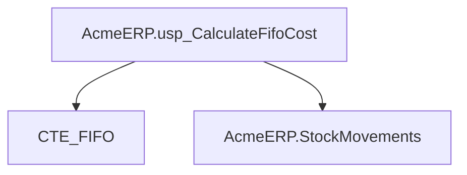
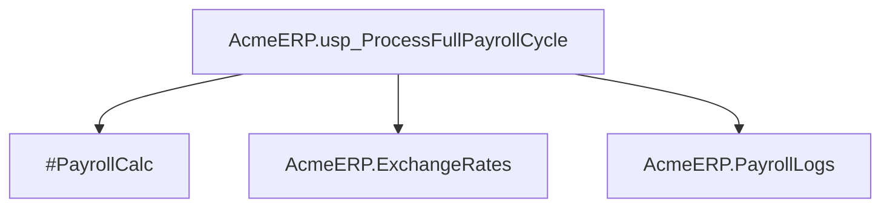
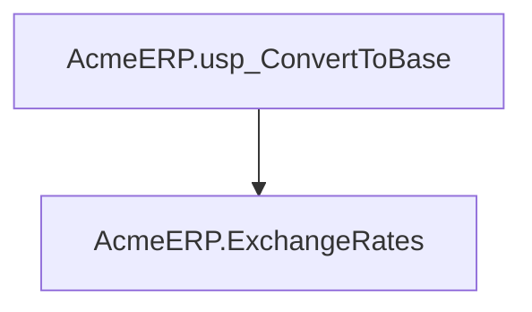
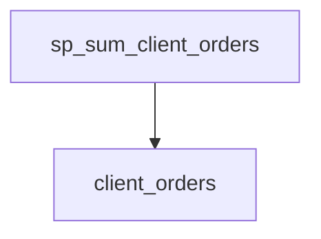
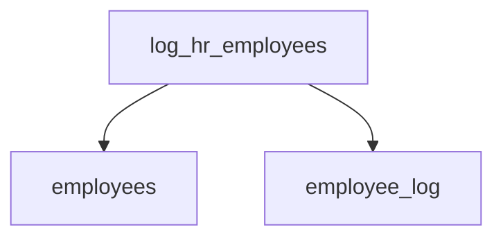
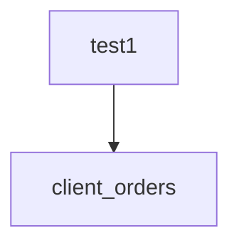
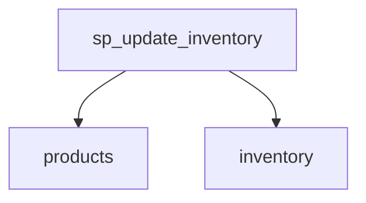

# Summary

- **Total Procedures**: 7
- **Total Tables**: 10
- **Most Called Procedure**: `N/A`

---

# Table of Contents

- [AcmeERP.usp_CalculateFifoCost](#acmeerpusp_calculatefifocost)
- [AcmeERP.usp_ProcessFullPayrollCycle](#acmeerpusp_processfullpayrollcycle)
- [AcmeERP.usp_ConvertToBase](#acmeerpusp_converttobase)
- [sp_sum_client_orders](#sp_sum_client_orders)
- [log_hr_employees](#log_hr_employees)
- [test1](#test1)
- [sp_update_inventory](#sp_update_inventory)

---

## Stored Procedure: AcmeERP.usp_CalculateFifoCost

---

### Parameters

| Name | Type |
|------|------|
| @ProductID | INTEGER |
| @QuantityRequested | INTEGER |

---

### Tables

- CTE_FIFO
- AcmeERP.StockMovements

---

### Called Procedures

---

### Call Graph

---

### Business Logic

The AcmeERP.usp_CalculateFifoCost stored procedure determines the cost of goods sold (COGS) for a given product using the First-In, First-Out (FIFO) inventory costing method.  It takes the product ID (@@ProductID) and the quantity requested (@@QuantityRequested) as input.  The procedure likely iterates through the `AcmeERP.StockMovements` table (potentially using a common table expression, CTE_FIFO, for optimization) to identify the oldest inventory units to fulfill the request, summing their costs to arrive at the total COGS for the specified quantity.  This calculation is crucial for accurate financial reporting and inventory valuation under the FIFO accounting principle.

---

## Stored Procedure: AcmeERP.usp_ProcessFullPayrollCycle

---

### Parameters

| Name | Type |
|------|------|
| @PayPeriodStart | DATE |
| @PayPeriodEnd | DATE |

---

### Tables

- #PayrollCalc
- AcmeERP.ExchangeRates
- AcmeERP.PayrollLogs

---

### Called Procedures

---

### Call Graph

---

### Business Logic

The `AcmeERP.usp_ProcessFullPayrollCycle` stored procedure calculates and processes the complete payroll for a given pay period, defined by the `@@PayPeriodStart` and `@@PayPeriodEnd` parameters.  It utilizes a temporary table, `#PayrollCalc`, to perform intermediate calculations, likely involving data from the `AcmeERP.ExchangeRates` table for currency conversions if applicable.  Finally, it logs the payroll processing details into the `AcmeERP.PayrollLogs` table, providing an audit trail of the entire payroll cycle.  This procedure represents the core business logic for generating employee paychecks and recording all associated financial transactions within the AcmeERP system.

---

## Stored Procedure: AcmeERP.usp_ConvertToBase

---

### Parameters

| Name | Type |
|------|------|
| @CurrencyCode | CHAR |
| @Amount | NUMERIC |
| @ConversionDate | DATE |

---

### Tables

- AcmeERP.ExchangeRates

---

### Called Procedures

---

### Call Graph

---

### Business Logic

The `AcmeERP.usp_ConvertToBase` stored procedure converts a given monetary amount from a specified currency into the base currency of the Acme ERP system.  It uses the exchange rate recorded in the `AcmeERP.ExchangeRates` table on the provided `@@ConversionDate` to perform the conversion.  The procedure takes the currency code (`@@CurrencyCode`), the amount to convert (`@@Amount`), and the conversion date (`@@ConversionDate`) as input parameters, returning the equivalent amount in the base currency.  It implicitly assumes the existence of a base currency within the system and leverages historical exchange rate data for accurate conversions.

---

## Stored Procedure: sp_sum_client_orders

---

### Parameters

| Name | Type |
|------|------|
| @client_id | INTEGER |
| @from_date | DATE |
| @to_date | DATE |

---

### Tables

- client_orders

---

### Called Procedures

---

### Call Graph

---

### Business Logic

Procedure `sp_sum_client_orders` calculates the total sum of client orders for a specified client within a given date range, applying a 5% discount to orders exceeding $750.  It iterates through each order for the given client and date range; if an order's total price surpasses $750, its discounted price (95% of the total) is added to a running total.  The final result represents the total value of the client's orders within the specified period after applying the bulk order discount.

---

## Stored Procedure: log_hr_employees

---

### Parameters

| Name | Type |
|------|------|

---

### Tables

- employees
- employee_log

---

### Called Procedures

---

### Call Graph

---

### Business Logic

The stored procedure `log_hr_employees` automatically records all HR department employees in the `employee_log` table.  It iterates through each employee in the `employees` table whose department is 'HR', capturing their ID and name, and appending a timestamp indicating the time of logging to the `employee_log` table. This provides an audit trail of HR employees, potentially for security, reporting, or other tracking purposes.  The procedure uses a cursor for row-by-row processing, although set-based operations might offer better performance for larger datasets.

---

## Stored Procedure: test1

---

### Parameters

| Name | Type |
|------|------|
| @client_id | INTEGER |
| @from_date | DATE |
| @to_date | DATE |

---

### Tables

- client_orders

---

### Called Procedures

---

### Call Graph

---

### Business Logic

Procedure `test1` calculates the total revenue for a given client (`@@client_id`) within a specified date range (`@@from_date` to `@@to_date`).  It iterates through each order in the `client_orders` table for that client and date range.  Orders with a `total_price` exceeding 750 receive a 5% discount before being added to the grand total; otherwise, the full order total is included.  The final output, `@grand_total`, represents the client's total revenue after applying any applicable discounts.

---

## Stored Procedure: sp_update_inventory

---

### Parameters

| Name | Type |
|------|------|

---

### Tables

- products
- inventory

---

### Called Procedures

---

### Call Graph

---

### Business Logic

The stored procedure `sp_update_inventory` automatically flags products requiring restocking.  It iterates through all active products (those not marked as discontinued) and checks their current inventory levels. If the total quantity of a product in inventory falls below 10 units, the procedure updates the product's record to indicate a need for restocking by setting the `restock` flag to 1.  This provides a system for proactively identifying low-stock items requiring replenishment.

---

