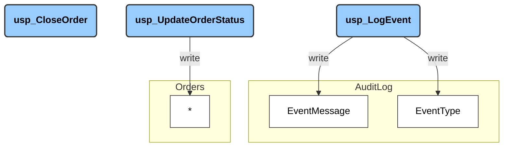

```mermaid
graph TD
    %% Node styles
    classDef table fill:#f96,stroke:#333,stroke-width:2px,color:#000,font-weight:bold;
    classDef stored_proc fill:#9cf,stroke:#333,stroke-width:2px,color:#000,font-weight:bold;
    classDef column fill:#fff,stroke:#333,stroke-width:1px,color:#000;


    subgraph AuditLog["AuditLog"]
        AuditLog_EventMessage["EventMessage"];
        class AuditLog_EventMessage column;
        AuditLog_EventType["EventType"];
        class AuditLog_EventType column;
    end

    subgraph Orders["Orders"]
        Orders__["*"];
        class Orders__ column;
    end
    usp_CloseOrder("usp_CloseOrder");
    class usp_CloseOrder stored_proc;
    usp_LogEvent("usp_LogEvent");
    class usp_LogEvent stored_proc;
    usp_UpdateOrderStatus("usp_UpdateOrderStatus");
    class usp_UpdateOrderStatus stored_proc;

    %% Relationships
    usp_LogEvent -- "write" --> AuditLog_EventMessage;
    usp_LogEvent -- "write" --> AuditLog_EventType;
    usp_UpdateOrderStatus -- "write" --> Orders__;
```