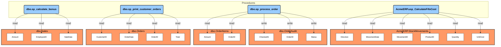

```mermaid
graph TD

    %% --- Styles --- %%
    classDef table fill:#f96,stroke:#333,stroke-width:2px,color:#000;
    classDef function fill:#9f6,stroke:#333,stroke-width:2px,color:#000,font-weight:bold;
    classDef trigger fill:#fa0,stroke:#333,stroke-width:2px,color:#000,font-weight:bold;
    classDef procedure fill:#9cf,stroke:#333,stroke-width:2px,color:#000,font-weight:bold;
    classDef column fill:#fff,stroke:#333,stroke-width:1px,color:#000,font-size:12px;


    %% --- Visual Hierarchy --- %%
    subgraph Procedures
        AcmeERP_usp_CalculateFifoCost
        dbo_sp_calculate_bonus
        dbo_sp_print_customer_orders
        dbo_sp_process_order
    end


    %% --- Node Definitions --- %%

    subgraph AcmeERP_StockMovements["AcmeERP.StockMovements"]
        AcmeERP_StockMovements_Direction["Direction"];
        class AcmeERP_StockMovements_Direction column;
        AcmeERP_StockMovements_MovementDate["MovementDate"];
        class AcmeERP_StockMovements_MovementDate column;
        AcmeERP_StockMovements_MovementID["MovementID"];
        class AcmeERP_StockMovements_MovementID column;
        AcmeERP_StockMovements_ProductID["ProductID"];
        class AcmeERP_StockMovements_ProductID column;
        AcmeERP_StockMovements_Quantity["Quantity"];
        class AcmeERP_StockMovements_Quantity column;
        AcmeERP_StockMovements_UnitCost["UnitCost"];
        class AcmeERP_StockMovements_UnitCost column;
    end
    class AcmeERP_StockMovements table;

    subgraph dbo_OrderAudit["dbo.OrderAudit"]
        dbo_OrderAudit_CheckedAt["CheckedAt"];
        class dbo_OrderAudit_CheckedAt column;
        dbo_OrderAudit_OrderID["OrderID"];
        class dbo_OrderAudit_OrderID column;
        dbo_OrderAudit_Status["Status"];
        class dbo_OrderAudit_Status column;
    end
    class dbo_OrderAudit table;

    subgraph dbo_OrderItems["dbo.OrderItems"]
        dbo_OrderItems_Amount["Amount"];
        class dbo_OrderItems_Amount column;
        dbo_OrderItems_OrderID["OrderID"];
        class dbo_OrderItems_OrderID column;
    end
    class dbo_OrderItems table;

    subgraph dbo_Orders["dbo.Orders"]
        dbo_Orders_CustomerID["CustomerID"];
        class dbo_Orders_CustomerID column;
        dbo_Orders_OrderDate["OrderDate"];
        class dbo_Orders_OrderDate column;
        dbo_Orders_OrderID["OrderID"];
        class dbo_Orders_OrderID column;
        dbo_Orders_Total["Total"];
        class dbo_Orders_Total column;
    end
    class dbo_Orders table;

    subgraph dbo_Sales["dbo.Sales"]
        dbo_Sales_Amount["Amount"];
        class dbo_Sales_Amount column;
        dbo_Sales_EmployeeID["EmployeeID"];
        class dbo_Sales_EmployeeID column;
        dbo_Sales_SaleDate["SaleDate"];
        class dbo_Sales_SaleDate column;
    end
    class dbo_Sales table;
    AcmeERP_usp_CalculateFifoCost("AcmeERP.usp_CalculateFifoCost");
    class AcmeERP_usp_CalculateFifoCost procedure;
    dbo_sp_calculate_bonus("dbo.sp_calculate_bonus");
    class dbo_sp_calculate_bonus procedure;
    dbo_sp_print_customer_orders("dbo.sp_print_customer_orders");
    class dbo_sp_print_customer_orders procedure;
    dbo_sp_process_order("dbo.sp_process_order");
    class dbo_sp_process_order procedure;

    %% --- Relationships --- %%
    AcmeERP_usp_CalculateFifoCost -- "read" --> AcmeERP_StockMovements_Direction;
    AcmeERP_usp_CalculateFifoCost -- "read" --> AcmeERP_StockMovements_MovementDate;
    AcmeERP_usp_CalculateFifoCost -- "read" --> AcmeERP_StockMovements_MovementID;
    AcmeERP_usp_CalculateFifoCost -- "read" --> AcmeERP_StockMovements_ProductID;
    AcmeERP_usp_CalculateFifoCost -- "read" --> AcmeERP_StockMovements_Quantity;
    AcmeERP_usp_CalculateFifoCost -- "read" --> AcmeERP_StockMovements_UnitCost;
    dbo_sp_calculate_bonus -- "read" --> dbo_Sales_Amount;
    dbo_sp_calculate_bonus -- "read" --> dbo_Sales_EmployeeID;
    dbo_sp_calculate_bonus -- "read" --> dbo_Sales_SaleDate;
    dbo_sp_print_customer_orders -- "read" --> dbo_Orders_CustomerID;
    dbo_sp_print_customer_orders -- "read" --> dbo_Orders_OrderDate;
    dbo_sp_print_customer_orders -- "read" --> dbo_Orders_OrderID;
    dbo_sp_print_customer_orders -- "read" --> dbo_Orders_Total;
    dbo_sp_process_order -- "read" --> dbo_OrderItems_Amount;
    dbo_sp_process_order -- "read" --> dbo_OrderItems_OrderID;
    dbo_sp_process_order -- "write" --> dbo_OrderAudit_CheckedAt;
    dbo_sp_process_order -- "write" --> dbo_OrderAudit_OrderID;
    dbo_sp_process_order -- "write" --> dbo_OrderAudit_Status;
```