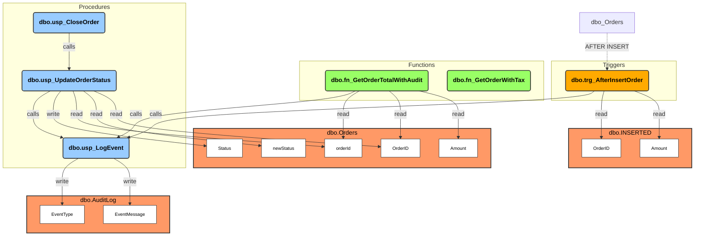

```mermaid
graph TD

    %% --- Styles --- %%
    classDef table fill:#f96,stroke:#333,stroke-width:2px,color:#000;
    classDef function fill:#9f6,stroke:#333,stroke-width:2px,color:#000,font-weight:bold;
    classDef trigger fill:#fa0,stroke:#333,stroke-width:2px,color:#000,font-weight:bold;
    classDef procedure fill:#9cf,stroke:#333,stroke-width:2px,color:#000,font-weight:bold;
    classDef column fill:#fff,stroke:#333,stroke-width:1px,color:#000,font-size:12px;


    %% --- Visual Hierarchy --- %%
    subgraph Functions
        dbo_fn_GetOrderTotalWithAudit
        dbo_fn_GetOrderWithTax
    end

    subgraph Triggers
        dbo_trg_AfterInsertOrder
    end

    subgraph Procedures
        dbo_usp_CloseOrder
        dbo_usp_LogEvent
        dbo_usp_UpdateOrderStatus
    end


    %% --- Node Definitions --- %%

    subgraph sg_dbo_AuditLog["dbo.AuditLog"]
        dbo_AuditLog_EventMessage["EventMessage"];
        class dbo_AuditLog_EventMessage column;
        dbo_AuditLog_EventType["EventType"];
        class dbo_AuditLog_EventType column;
    end
    class sg_dbo_AuditLog table;

    subgraph sg_dbo_INSERTED["dbo.INSERTED"]
        dbo_INSERTED_Amount["Amount"];
        class dbo_INSERTED_Amount column;
        dbo_INSERTED_OrderID["OrderID"];
        class dbo_INSERTED_OrderID column;
    end
    class sg_dbo_INSERTED table;

    subgraph sg_dbo_Orders["dbo.Orders"]
        dbo_Orders_Amount["Amount"];
        class dbo_Orders_Amount column;
        dbo_Orders_OrderID["OrderID"];
        class dbo_Orders_OrderID column;
        dbo_Orders_Status["Status"];
        class dbo_Orders_Status column;
        dbo_Orders_newStatus["newStatus"];
        class dbo_Orders_newStatus column;
        dbo_Orders_orderId["orderId"];
        class dbo_Orders_orderId column;
    end
    class sg_dbo_Orders table;
    dbo_fn_GetOrderTotalWithAudit("dbo.fn_GetOrderTotalWithAudit");
    class dbo_fn_GetOrderTotalWithAudit function;
    dbo_fn_GetOrderWithTax("dbo.fn_GetOrderWithTax");
    class dbo_fn_GetOrderWithTax function;
    dbo_trg_AfterInsertOrder("dbo.trg_AfterInsertOrder");
    class dbo_trg_AfterInsertOrder trigger;
    dbo_usp_CloseOrder("dbo.usp_CloseOrder");
    class dbo_usp_CloseOrder procedure;
    dbo_usp_LogEvent("dbo.usp_LogEvent");
    class dbo_usp_LogEvent procedure;
    dbo_usp_UpdateOrderStatus("dbo.usp_UpdateOrderStatus");
    class dbo_usp_UpdateOrderStatus procedure;

    %% --- Relationships --- %%
    dbo_Orders -.->|AFTER INSERT| dbo_trg_AfterInsertOrder;
    dbo_fn_GetOrderTotalWithAudit -- "read" --> dbo_Orders_Amount;
    dbo_fn_GetOrderTotalWithAudit -- "read" --> dbo_Orders_OrderID;
    dbo_fn_GetOrderTotalWithAudit -- "read" --> dbo_Orders_orderId;
    dbo_fn_GetOrderTotalWithAudit -->|calls| dbo_usp_LogEvent;
    dbo_trg_AfterInsertOrder -- "read" --> dbo_INSERTED_Amount;
    dbo_trg_AfterInsertOrder -- "read" --> dbo_INSERTED_OrderID;
    dbo_trg_AfterInsertOrder -->|calls| dbo_usp_LogEvent;
    dbo_usp_CloseOrder -->|calls| dbo_usp_UpdateOrderStatus;
    dbo_usp_LogEvent -- "write" --> dbo_AuditLog_EventMessage;
    dbo_usp_LogEvent -- "write" --> dbo_AuditLog_EventType;
    dbo_usp_UpdateOrderStatus -- "read" --> dbo_Orders_OrderID;
    dbo_usp_UpdateOrderStatus -- "read" --> dbo_Orders_newStatus;
    dbo_usp_UpdateOrderStatus -- "read" --> dbo_Orders_orderId;
    dbo_usp_UpdateOrderStatus -- "write" --> dbo_Orders_Status;
    dbo_usp_UpdateOrderStatus -->|calls| dbo_usp_LogEvent;
```