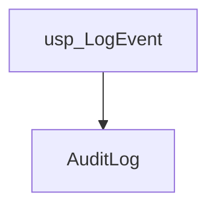
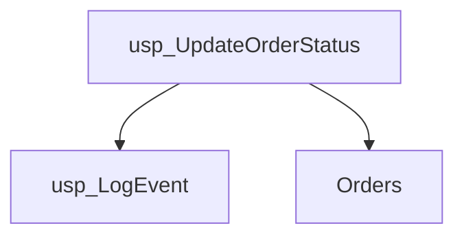
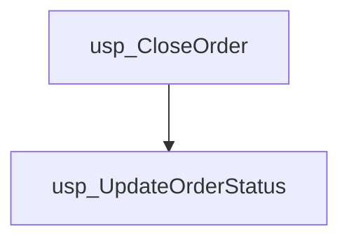

# Summary

- **Total Procedures**: 3
- **Total Tables**: 2
- **Most Called Procedure**: `usp_LogEvent`

---

# Table of Contents

- [usp_LogEvent](#usp_logevent)
- [usp_UpdateOrderStatus](#usp_updateorderstatus)
- [usp_CloseOrder](#usp_closeorder)

---

## Stored Procedure: usp_LogEvent

---

### Parameters

| Name | Type |
|------|------|
| @eventType | VARCHAR(50) |
| @message | VARCHAR(200) |

---

### Tables

- AuditLog

---

### Called Procedures

---

### Call Graph

---

### Business Logic

The stored procedure `usp_LogEvent` records events in the `AuditLog` table.  It accepts an event type and a message as input parameters and logs this information for auditing purposes, providing a record of significant system activities.

---

## Stored Procedure: usp_UpdateOrderStatus

---

### Parameters

| Name | Type |
|------|------|
| @orderId | INT |
| @newStatus | VARCHAR(20) |

---

### Tables

- Orders

---

### Called Procedures

- usp_LogEvent

---

### Call Graph

---

### Business Logic

The stored procedure `usp_UpdateOrderStatus` modifies the status of an order in the `Orders` table.  It accepts the order ID (@@orderId) and the new order status (@@newStatus) as input parameters, updating the corresponding order's status accordingly.  This procedure facilitates changes to order status throughout the order lifecycle, such as reflecting transitions from 'placed' to 'shipped' or 'shipped' to 'delivered'.

---

## Stored Procedure: usp_CloseOrder

---

### Parameters

| Name | Type |
|------|------|
| @orderId | INT |

---

### Tables

---

### Called Procedures

- usp_UpdateOrderStatus

---

### Call Graph

---

### Business Logic

The provided SQL procedure `usp_CloseOrder` lacks any SQL code, therefore its business logic cannot be described.  No information is available about how it closes orders or what actions it performs.

---

