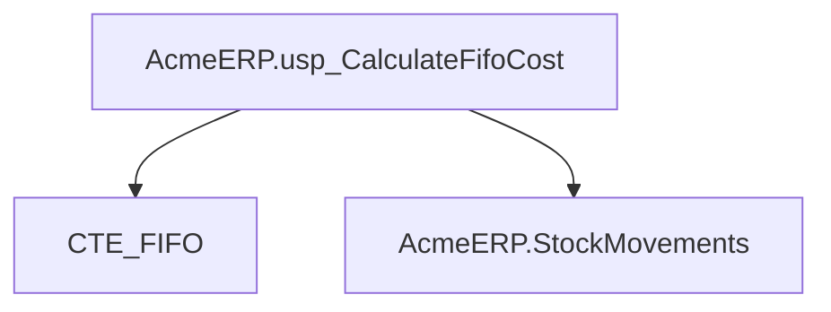
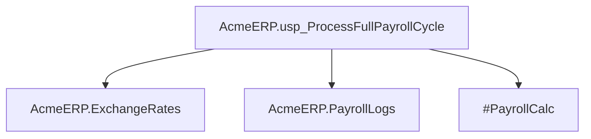
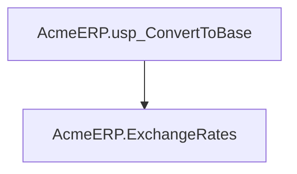
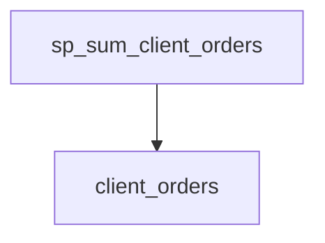
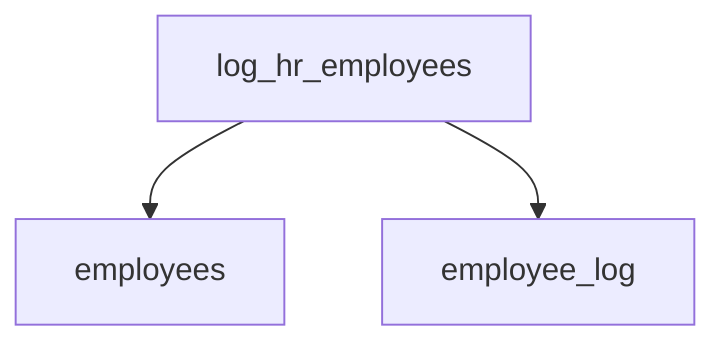
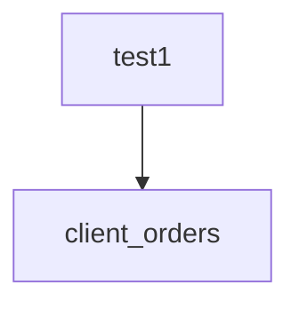
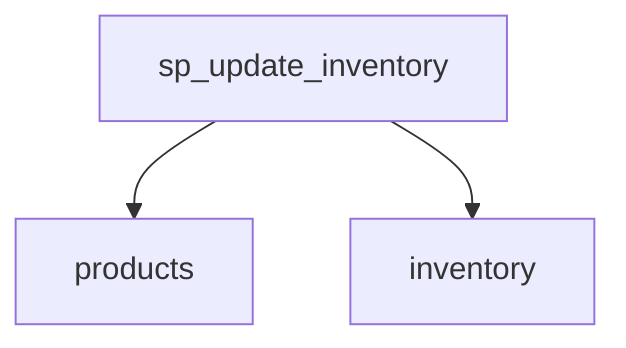

# Summary

- **Total Procedures**: 7
- **Total Tables**: 10
- **Most Called Procedure**: `N/A`

---

# Table of Contents

- [AcmeERP.usp_CalculateFifoCost](#acmeerpusp_calculatefifocost)
- [AcmeERP.usp_ProcessFullPayrollCycle](#acmeerpusp_processfullpayrollcycle)
- [AcmeERP.usp_ConvertToBase](#acmeerpusp_converttobase)
- [sp_sum_client_orders](#sp_sum_client_orders)
- [log_hr_employees](#log_hr_employees)
- [test1](#test1)
- [sp_update_inventory](#sp_update_inventory)

---

## Stored Procedure: AcmeERP.usp_CalculateFifoCost

---

### Parameters

| Name | Type |
|------|------|
| @ProductID | INTEGER |
| @QuantityRequested | INTEGER |

---

### Tables

- CTE_FIFO
- AcmeERP.StockMovements

---

### Called Procedures

---

### Call Graph

---

### Business Logic

The AcmeERP.usp_CalculateFifoCost stored procedure calculates the cost of goods sold for a given product using the First-In, First-Out (FIFO) method.  It takes a product ID and requested quantity as input, and uses the AcmeERP.StockMovements table and a common table expression (CTE_FIFO) to determine the cost based on the order in which stock was received.  The procedure returns the total cost of the requested quantity, reflecting the cost of the oldest inventory items first.

---

## Stored Procedure: AcmeERP.usp_ProcessFullPayrollCycle

---

### Parameters

| Name | Type |
|------|------|
| @PayPeriodStart | DATE |
| @PayPeriodEnd | DATE |

---

### Tables

- AcmeERP.ExchangeRates
- AcmeERP.PayrollLogs
- #PayrollCalc

---

### Called Procedures

---

### Call Graph

---

### Business Logic

The AcmeERP.usp_ProcessFullPayrollCycle stored procedure calculates and processes the complete payroll for a specified pay period, defined by the input parameters @@PayPeriodStart and @@PayPeriodEnd.  It utilizes exchange rate data from AcmeERP.ExchangeRates and logs payroll processing activities in AcmeERP.PayrollLogs.  A temporary table, #PayrollCalc, is used for intermediate calculations during the payroll processing.

---

## Stored Procedure: AcmeERP.usp_ConvertToBase

---

### Parameters

| Name | Type |
|------|------|
| @CurrencyCode | CHAR |
| @Amount | NUMERIC |
| @ConversionDate | DATE |

---

### Tables

- AcmeERP.ExchangeRates

---

### Called Procedures

---

### Call Graph

---

### Business Logic

The AcmeERP.usp_ConvertToBase stored procedure converts a given amount from a specified currency into the base currency of the Acme ERP system.  It uses the exchange rate recorded in the AcmeERP.ExchangeRates table on the provided conversion date to perform the calculation.  The procedure returns the equivalent amount in the base currency.

---

## Stored Procedure: sp_sum_client_orders

---

### Parameters

| Name | Type |
|------|------|
| @client_id | INTEGER |
| @from_date | DATE |
| @to_date | DATE |

---

### Tables

- client_orders

---

### Called Procedures

---

### Call Graph

---

### Business Logic

The stored procedure `sp_sum_client_orders` calculates the total sum of orders for a specific client within a given date range.  It uses the `client_orders` table to retrieve order information, filtering by the provided client ID and date parameters (from_date and to_date).  The result represents the aggregated order value for the specified client during the selected period.

---

## Stored Procedure: log_hr_employees

---

### Parameters

| Name | Type |
|------|------|

---

### Tables

- employees
- employee_log

---

### Called Procedures

---

### Call Graph

---

### Business Logic

The procedure `log_hr_employees` lacks a SQL body, therefore its business logic cannot be described.  No action is performed relating to employees or employee logs.

---

## Stored Procedure: test1

---

### Parameters

| Name | Type |
|------|------|
| @client_id | INTEGER |
| @from_date | DATE |
| @to_date | DATE |

---

### Tables

- client_orders

---

### Called Procedures

---

### Call Graph

---

### Business Logic

The procedure `test1` lacks SQL code, therefore no business logic can be described.  It is expected to retrieve and potentially process client order information from the `client_orders` table, filtered by client ID (`@@client_id`) and a date range specified by `@@from_date` and `@@to_date`.  Without the SQL code, the exact nature of the processing (e.g., aggregation, summarization, detailed retrieval) remains unknown.

---

## Stored Procedure: sp_update_inventory

---

### Parameters

| Name | Type |
|------|------|

---

### Tables

- products
- inventory

---

### Called Procedures

---

### Call Graph

---

### Business Logic

The stored procedure `sp_update_inventory` lacks a provided SQL source code, therefore its business logic cannot be described.  No information is available on how it updates the `products` and `inventory` tables.

---

