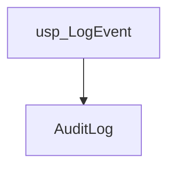
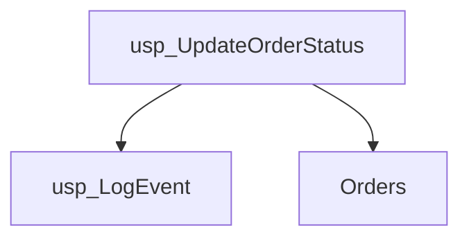
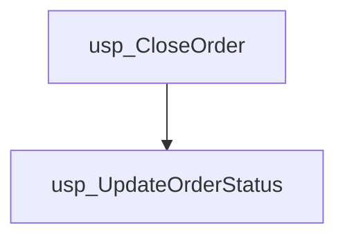
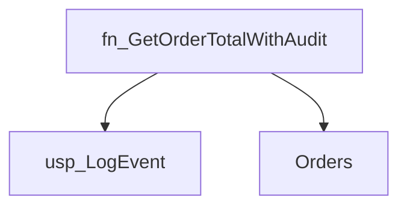
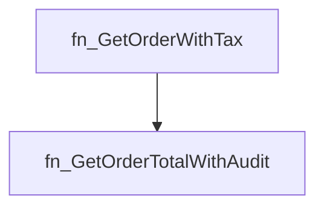
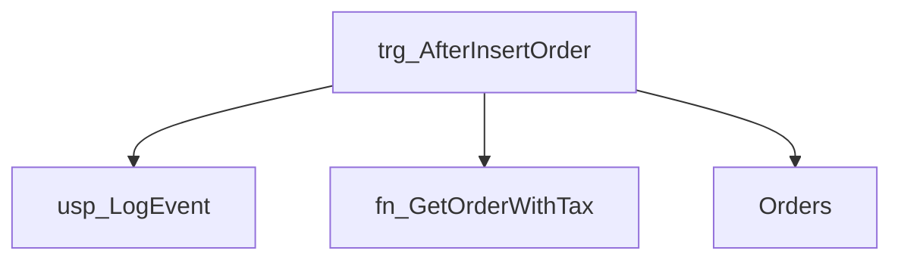

# Summary

- **Total Procedures**: 3
- **Total Functions**: 2
- **Total Triggers**: 1
- **Total Tables**: 2
- **Most Called Object**: `usp_LogEvent`

---

# Table of Contents

- Procedure: [usp_LogEvent](#usp_logevent)
- Procedure: [usp_UpdateOrderStatus](#usp_updateorderstatus)
- Procedure: [usp_CloseOrder](#usp_closeorder)
- Function: [fn_GetOrderTotalWithAudit](#fn_getordertotalwithaudit)
- Function: [fn_GetOrderWithTax](#fn_getorderwithtax)
- Trigger: [trg_AfterInsertOrder](#trg_afterinsertorder)

---

## Procedure: usp_LogEvent

---

### Parameters

| Name | Type |
|------|------|
| @eventType | VARCHAR(50) |
| @message | VARCHAR(200) |

---

### Tables

- AuditLog

---

### Calls

---

### Call Graph

---

### Business Logic

The stored procedure `usp_LogEvent` records application events in the `AuditLog` table.  It accepts the event type and a descriptive message as input parameters and inserts a new log entry containing this information, providing a mechanism for tracking significant application activities for auditing and troubleshooting purposes.

---

## Procedure: usp_UpdateOrderStatus

---

### Parameters

| Name | Type |
|------|------|
| @orderId | INT |
| @newStatus | VARCHAR(20) |

---

### Tables

- Orders

---

### Calls

- usp_LogEvent

---

### Call Graph

---

### Business Logic

The stored procedure `usp_UpdateOrderStatus` modifies the status of an order in the `Orders` table.  It accepts an order ID and a new status as input, updates the order's status accordingly, and then logs the change in a separate event log using the `usp_LogEvent` procedure.

---

## Procedure: usp_CloseOrder

---

### Parameters

| Name | Type |
|------|------|
| @orderId | INT |

---

### Tables

---

### Calls

- usp_UpdateOrderStatus

---

### Call Graph

---

### Business Logic

The stored procedure `usp_CloseOrder` closes an order specified by its ID.  It achieves this by calling another stored procedure, `usp_UpdateOrderStatus`, to update the order's status to 'CLOSED'.

---

## Function: fn_GetOrderTotalWithAudit

---

### Parameters

| Name | Type |
|------|------|
| @orderId | INT |

---

### Tables

- Orders

---

### Calls

- usp_LogEvent

---

### Call Graph

---

### Business Logic

This function retrieves the total amount for a specified order and logs the function call in an audit trail.  It takes an order ID as input, queries the Orders table to find the corresponding order amount, and then uses a stored procedure to record an audit entry indicating the function was called with the given order ID.  The function then returns the retrieved order amount.

---

## Function: fn_GetOrderWithTax

---

### Parameters

| Name | Type |
|------|------|
| @orderId | INT |

---

### Tables

---

### Calls

- fn_GetOrderTotalWithAudit

---

### Call Graph

---

### Business Logic

The function fn_GetOrderWithTax calculates the total amount of an order including a 10% tax.  It retrieves the order's base amount from the function dbo.fn_GetOrderTotalWithAudit using the provided order ID and then applies a 10% tax rate to this base amount, returning the final amount including tax.

---

## Trigger: trg_AfterInsertOrder

---

### Tables

- Orders

---

### Calls

- usp_LogEvent
- fn_GetOrderWithTax

---

### Call Graph

---

### Business Logic

This trigger, trg_AfterInsertOrder, automatically logs events whenever a new order is added to the Orders table.  Specifically, it records the insertion of a new order, including its ID and amount, via a stored procedure call (usp_LogEvent).  Furthermore, it calculates the order total including tax using a user-defined function (fn_GetOrderWithTax) and logs this calculated value using the same stored procedure.  This ensures that all new order insertions are tracked in a central log, providing an audit trail and potentially supporting business intelligence reporting.

---

