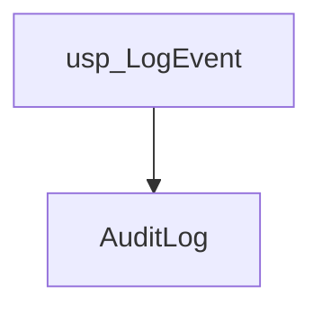
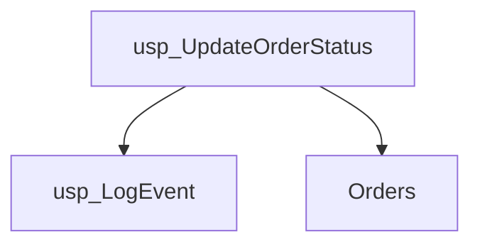
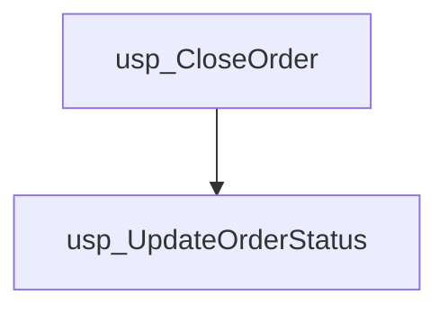
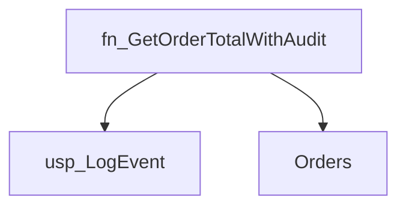
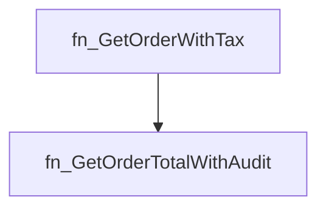
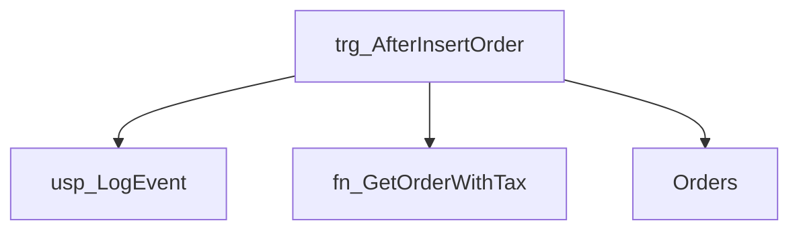

# Summary

- **Total Procedures**: 3
- **Total Functions**: 2
- **Total Triggers**: 1
- **Total Tables**: 2
- **Most Called Object**: `usp_LogEvent`

---

# Table of Contents

- Procedure: [usp_LogEvent](#usp_logevent)
- Procedure: [usp_UpdateOrderStatus](#usp_updateorderstatus)
- Procedure: [usp_CloseOrder](#usp_closeorder)
- Function: [fn_GetOrderTotalWithAudit](#fn_getordertotalwithaudit)
- Function: [fn_GetOrderWithTax](#fn_getorderwithtax)
- Trigger: [trg_AfterInsertOrder](#trg_afterinsertorder)

---

## Procedure: usp_LogEvent

---

### Parameters

| Name | Type |
|------|------|
| @eventType | VARCHAR(50) |
| @message | VARCHAR(200) |

---

### Tables

- AuditLog

---

### Calls

---

### Call Graph

---

### Business Logic

The stored procedure `usp_LogEvent` records application events in the `AuditLog` table.  It accepts the event type and a descriptive message as input parameters, then inserts a new log entry containing this information.  This allows for tracking of significant application activities for auditing, monitoring, and troubleshooting purposes.

---

## Procedure: usp_UpdateOrderStatus

---

### Parameters

| Name | Type |
|------|------|
| @orderId | INT |
| @newStatus | VARCHAR(20) |

---

### Tables

- Orders

---

### Calls

- usp_LogEvent

---

### Call Graph

---

### Business Logic

This stored procedure, usp_UpdateOrderStatus, modifies the status of an order in the Orders table.  It accepts the order ID and the new status as input, updates the corresponding order's status, and then logs the change in the system's event log, recording the order ID and the new status.

---

## Procedure: usp_CloseOrder

---

### Parameters

| Name | Type |
|------|------|
| @orderId | INT |

---

### Tables

---

### Calls

- usp_UpdateOrderStatus

---

### Call Graph

---

### Business Logic

The stored procedure `usp_CloseOrder` closes a specific order identified by its `orderId`.  It achieves this by calling another stored procedure, `usp_UpdateOrderStatus`, to change the order's status to 'CLOSED'.

---

## Function: fn_GetOrderTotalWithAudit

---

### Parameters

| Name | Type |
|------|------|
| @orderId | INT |

---

### Tables

- Orders

---

### Calls

- usp_LogEvent

---

### Call Graph

---

### Business Logic

This function retrieves the total amount for a specified order and logs the function call in an audit trail.  It takes an order ID as input, queries the Orders table to find the corresponding order amount, and then uses a stored procedure to record the function execution in the audit log before returning the order's total amount.

---

## Function: fn_GetOrderWithTax

---

### Parameters

| Name | Type |
|------|------|
| @orderId | INT |

---

### Tables

---

### Calls

- fn_GetOrderTotalWithAudit

---

### Call Graph

---

### Business Logic

The function fn_GetOrderWithTax calculates the total amount of an order including a 10% tax.  It retrieves the order's base amount from the function dbo.fn_GetOrderTotalWithAudit using the provided order ID and then applies a 10% tax rate to determine the final amount, which is returned as a decimal value.

---

## Trigger: trg_AfterInsertOrder

---

### Tables

- Orders

---

### Calls

- usp_LogEvent
- fn_GetOrderWithTax

---

### Call Graph

---

### Business Logic

This trigger, trg_AfterInsertOrder, automatically logs order creation events.  After a new order is inserted into the Orders table, it captures the order ID and amount. It then calls a stored procedure, usp_LogEvent, to record the order insertion details in a log.  Furthermore, it calls a function, fn_GetOrderWithTax, to calculate the order total including tax, and logs this calculated amount via the same stored procedure.  This ensures that all new order creation events are logged, providing an audit trail and facilitating order tracking and analysis.

---

