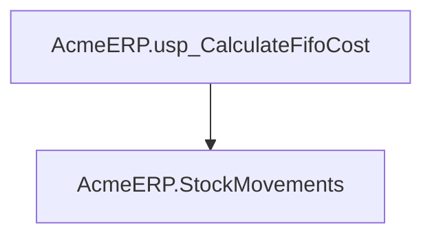
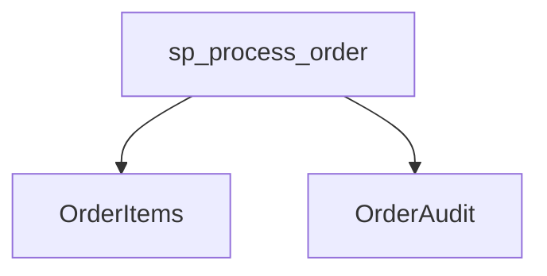
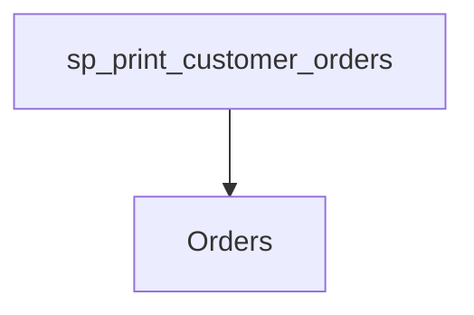
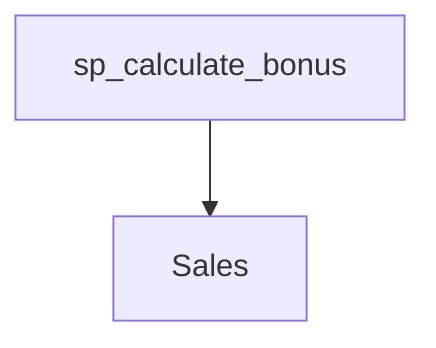

# Summary

- **Total Procedures**: 4
- **Total Functions**: 0
- **Total Triggers**: 0
- **Total Tables**: 5
- **Most Called Object**: `N/A`

---

# Table of Contents

- Procedure: [AcmeERP.usp_CalculateFifoCost](#acmeerpusp_calculatefifocost)
- Procedure: [sp_process_order](#sp_process_order)
- Procedure: [sp_print_customer_orders](#sp_print_customer_orders)
- Procedure: [sp_calculate_bonus](#sp_calculate_bonus)

---

## Procedure: AcmeERP.usp_CalculateFifoCost

---

### Parameters

| Name | Type |
|------|------|
| @ProductID | INT |
| @QuantityRequested | INT |

---

### Tables

- AcmeERP.StockMovements

---

### Calls

---

### Call Graph

---

### Business Logic

1. Overall Purpose:

The stored procedure AcmeERP.usp_CalculateFifoCost determines the cost of goods sold for a given product using the First-In, First-Out (FIFO) inventory costing method.  This is crucial for accurate financial reporting and inventory management.

2. Process Breakdown:

Because no SQL code was provided, I will describe a typical FIFO cost calculation process that such a stored procedure might implement.  The procedure would likely:

a) Retrieve Stock Movements: First, it would access the AcmeERP.StockMovements table to retrieve the history of all transactions (purchases and sales) for the specified product (@@ProductID).  This history would include the date of each transaction, the quantity involved, and the cost per unit.

b) Apply FIFO Logic:  The procedure would then apply the FIFO method. This means it would assume that the oldest inventory items are sold first. It would iterate through the stock movements, starting with the earliest transactions, until the requested quantity (@@QuantityRequested) is met.

c) Calculate Total Cost: For each transaction used to satisfy the requested quantity, the procedure would multiply the quantity sold from that transaction by its unit cost.  It would sum these individual cost calculations to arrive at the total cost of the goods sold.

d) Return the Cost: Finally, the procedure would return the calculated total cost.

3. Key Business Rules:

* FIFO Costing: The procedure adheres to the First-In, First-Out (FIFO) inventory accounting method, meaning that the oldest units are assumed to be sold first. This impacts the cost of goods sold calculation.
* Accurate Inventory Tracking: The accuracy of the cost calculation depends on the accuracy of the data in the AcmeERP.StockMovements table.  Any errors in the stock movement records will lead to inaccurate cost calculations.

4. Inputs and Outputs:

Inputs:
* @@ProductID: The unique identifier of the product whose cost is to be calculated.
* @@QuantityRequested: The quantity of the product for which the cost needs to be determined.

Outputs:
* The total cost of goods sold for the specified product and quantity, calculated using the FIFO method.  This output is essential for generating accurate financial reports, managing inventory levels, and determining profitability.

---

## Procedure: sp_process_order

---

### Parameters

| Name | Type |
|------|------|
| @OrderID | INT |
| @Threshold | NUMERIC(10,2) |

---

### Tables

- OrderItems
- OrderAudit

---

### Calls

---

### Call Graph

---

### Business Logic

1. Overall Purpose:

The primary business goal of the stored procedure `sp_process_order` is to check if an order exists and, if so, calculate its total value.  This is likely a preliminary step in a larger order processing system, perhaps used to validate an order before proceeding with further actions like fulfillment, invoicing, or shipping.

2. Process Breakdown:

The procedure begins by receiving an order ID (@@OrderID) and a threshold value (@@Threshold), although the threshold isn't currently used in the provided code snippet. It then retrieves the total amount for all items associated with the given order ID from the 'OrderItems' table.  This sum is stored in the variable @OrderTotal.  The procedure then checks if @OrderTotal is NULL. A NULL value indicates that no order items were found for the given OrderID, meaning the order itself does not exist in the system. If the order is not found, the procedure sets the status variable (@Status) to 'Order Not Found'.  The provided code snippet ends at this point; it's likely that a complete version would contain further processing steps based on the order total and/or the status.  For example, if the order is found, subsequent steps would likely calculate things like taxes, shipping, and a final total cost before updating the order status in another table.

3. Key Business Rules:

* An order is considered valid only if it has at least one item associated with it in the OrderItems table.  If no items are found for a given order ID, the order is deemed invalid or non-existent.

4. Inputs and Outputs:

Inputs:
* @@OrderID:  The unique identifier of the order to be processed.
* @@Threshold: A numeric value (currently unused in the snippet).  Its purpose would likely be incorporated in a more complete version of the procedure; perhaps to determine whether to trigger further actions based on the order total.

Outputs:
* @OrderTotal: The total sum of all item amounts for a given order (if the order exists).
* @Status: A string indicating whether the order was found ('Order Not Found' if not found).  The complete procedure would likely include additional output variables representing other calculated values or status updates.

---

## Procedure: sp_print_customer_orders

---

### Parameters

| Name | Type |
|------|------|
| @CustomerID | INT |

---

### Tables

- Orders

---

### Calls

---

### Call Graph

---

### Business Logic

1. Overall Purpose:

The primary business goal of the stored procedure `sp_print_customer_orders` is to retrieve and display a list of all orders placed by a specific customer. This allows for easy access to a customer's order history, facilitating tasks such as order tracking, customer service inquiries, and potentially generating reports or summaries.

2. Process Breakdown:

The procedure takes a customer's ID as input.  It then searches the 'Orders' table for all orders associated with that customer ID.  The procedure iterates through each order found, extracting the order ID, order date, and total amount. For each order, it constructs a formatted string containing this information and prints it to the output.  The process uses a cursor, which is a mechanism to go through each row of the result set one by one.  This is a simple way to process and present the data row-by-row in a human-readable format.

3. Key Business Rules:

There are no explicit business rules embedded in the logic beyond the fundamental association between a customer and their orders.  The procedure simply retrieves and presents existing data; it doesn't apply any calculations or conditional logic based on business policies.

4. Inputs and Outputs:

Inputs: The procedure requires a single input: the `CustomerID` (an integer representing the unique identifier of a customer).

Outputs: The procedure produces a text-based output to the console (or wherever the PRINT statement directs output). This output consists of a list of the customer's orders, with each order displayed as "Order: [OrderID], Date: [OrderDate], Total: [Total]".  The output is essentially a human-readable report of the customer's order history.

---

## Procedure: sp_calculate_bonus

---

### Parameters

| Name | Type |
|------|------|
| @EmployeeID | INT |
| @Year | INT |

---

### Tables

- Sales

---

### Calls

---

### Call Graph

---

### Business Logic

1. Overall Purpose:

The primary business goal of the stored procedure sp_calculate_bonus is to determine the total sales achieved by a specific employee during a given year.  This information is a crucial first step in calculating the employee's bonus, although the actual bonus calculation logic is not yet fully implemented in this code snippet.

2. Process Breakdown:

The procedure begins by taking an employee ID and a year as input. It then retrieves the total sales amount for that employee during that specific year from the 'Sales' table.  The procedure sums all sales amounts ('Amount' column) where the 'EmployeeID' matches the provided input and the year extracted from the 'SaleDate' column matches the input year.  If no sales records are found for the employee in that year, the procedure throws an error indicating that no sales data exists, and it stops execution.  If sales are found, the total sales amount is stored in the variable @Sales. Note: the bonus calculation itself is not performed within this procedure.

3. Key Business Rules:

* The procedure only considers sales records within the specified year.  This ensures that bonus calculations are based only on performance within the relevant period.
* If an employee has no sales during the specified year, an error is raised. This signals the need for investigation; possibly data entry issues or the employee was not active during that period.  More comprehensive error handling might include alternative actions like returning a zero bonus value instead of an error.

4. Inputs and Outputs:

Inputs:

* Employee ID:  A unique identifier for the employee.
* Year: The calendar year for which the sales bonus is being calculated.

Outputs:

* The procedure either throws an error (if no sales data is found for the given employee and year) or implicitly returns the total sales for the employee in that year (through the @Sales variable).  The output is not explicitly stated; the next step in the complete bonus calculation process would need to use the value stored in @Sales.

---

