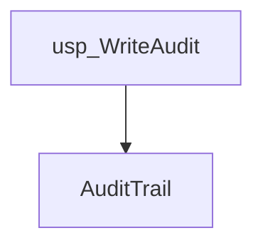
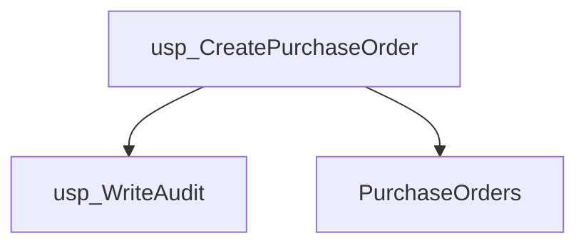
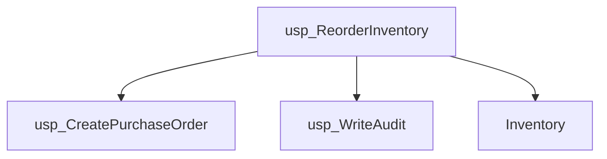
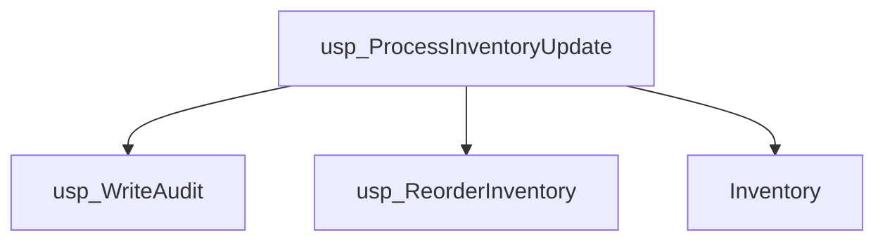
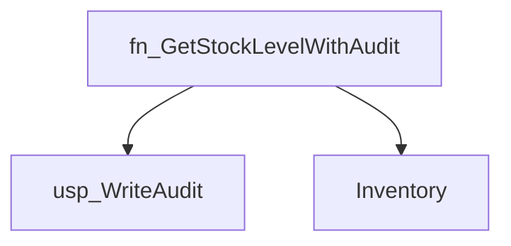
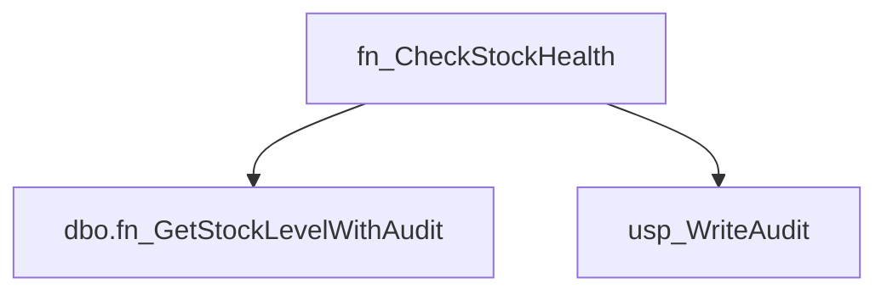
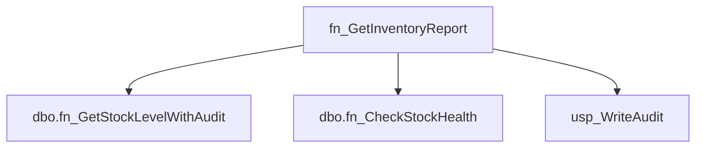
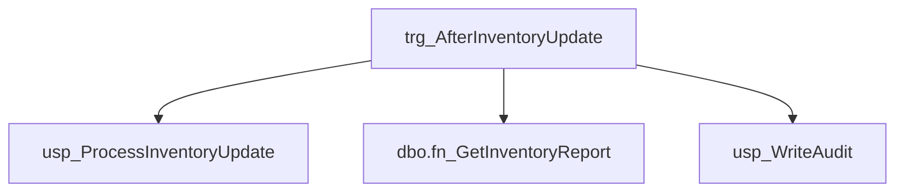
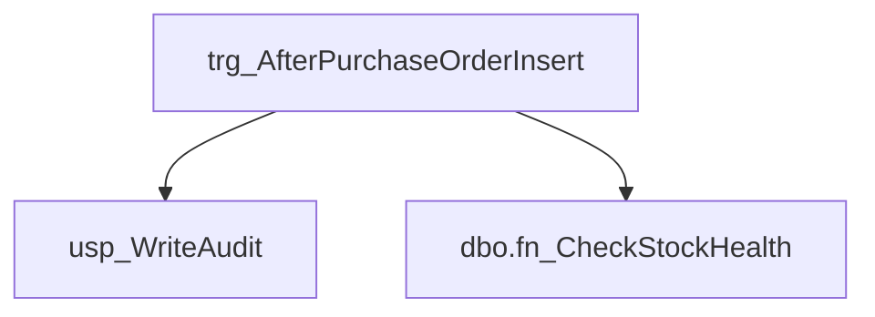

# Summary

- **Total Procedures**: 4
- **Total Functions**: 3
- **Total Triggers**: 2
- **Total Tables**: 3
- **Most Called Object**: `usp_WriteAudit`

---

# Table of Contents

- Procedure: [usp_WriteAudit](#usp_writeaudit)
- Procedure: [usp_CreatePurchaseOrder](#usp_createpurchaseorder)
- Procedure: [usp_ReorderInventory](#usp_reorderinventory)
- Procedure: [usp_ProcessInventoryUpdate](#usp_processinventoryupdate)
- Function: [fn_GetStockLevelWithAudit](#fn_getstocklevelwithaudit)
- Function: [fn_CheckStockHealth](#fn_checkstockhealth)
- Function: [fn_GetInventoryReport](#fn_getinventoryreport)
- Trigger: [trg_AfterInventoryUpdate](#trg_afterinventoryupdate)
- Trigger: [trg_AfterPurchaseOrderInsert](#trg_afterpurchaseorderinsert)

---

## Procedure: usp_WriteAudit

---

### Parameters

| Name | Type |
|------|------|
| @eventType | VARCHAR(50) |
| @details | VARCHAR(200) |

---

### Tables

- AuditTrail

---

### Calls

---

### Call Graph

---

### Business Logic

<<<<<<< HEAD
Description could not be generated due to an OpenRouter API error: 401 Client Error: Unauthorized for url: https://openrouter.ai/api/v1/chat/completions
=======
Overall Purpose:
1. The primary business goal of the usp_WriteAudit stored procedure is to log audit trail events in a database table for tracking and monitoring purposes.

Process Breakdown:
2. The procedure starts by receiving two inputs: the event type (such as login, logout, data update, etc.) and details about the event.
3. It then inserts this information into the AuditTrail table, which serves as a log to record all the events that occur within the system.
4. By doing this, the procedure automates the process of capturing and storing audit trail information, ensuring that all relevant events are logged for future reference.
  
Key Business Rules:
5. One key business rule embedded in this logic is that every event type and its corresponding details must be recorded in the AuditTrail table without any exceptions.
  
Inputs and Outputs:
6. Inputs: The procedure requires two pieces of information - the event type (e.g., login, logout) and the details of the event (e.g., user ID, timestamp).
7. Outputs: The procedure outputs the logged information into the AuditTrail table, providing a comprehensive record of all system events for auditing and monitoring purposes.
>>>>>>> 1e22c2f2e0ba7dfab25e67177739aae1cdfed440

---

## Procedure: usp_CreatePurchaseOrder

---

### Parameters

| Name | Type |
|------|------|
| @itemId | INT |
| @quantity | INT |

---

### Tables

- PurchaseOrders

---

### Calls

- usp_WriteAudit

---

### Call Graph

---

### Business Logic

<<<<<<< HEAD
Description could not be generated due to an OpenRouter API error: 401 Client Error: Unauthorized for url: https://openrouter.ai/api/v1/chat/completions
=======
Overall Purpose:
1. The primary business goal of this stored procedure is to automate the creation of a new purchase order in the system when a user requests to purchase a certain quantity of a specific item.

Process Breakdown:
2. Step 1: The procedure takes two input parameters, @itemId (the ID of the item being purchased) and @quantity (the quantity of the item being purchased).
3. Step 2: It then inserts a new record into the PurchaseOrders table with the provided ItemID, Quantity, and sets the Status of the purchase order to 'OPEN'.
4. Step 3: Additionally, it executes another stored procedure called usp_WriteAudit to log an audit trail of the purchase order creation, including details like the item ID and quantity.

Key Business Rules:
5. The main business rule in this logic is that every purchase order created through this procedure will have an initial status of 'OPEN', indicating that the order is in progress and has not been completed or canceled.
6. Another important business rule is the generation of an audit trail for every purchase order created, ensuring transparency and accountability in the purchasing process.

Inputs and Outputs:
7. Inputs: The procedure requires two inputs - the ID of the item being purchased (@itemId) and the quantity of that item (@quantity).
8. Outputs: The procedure outputs a newly created purchase order record in the PurchaseOrders table with the specified item ID, quantity, and 'OPEN' status. Additionally, an audit log entry is created to track the creation of the purchase order.
>>>>>>> 1e22c2f2e0ba7dfab25e67177739aae1cdfed440

---

## Procedure: usp_ReorderInventory

---

### Parameters

| Name | Type |
|------|------|
| @itemId | INT |

---

### Tables

- Inventory

---

### Calls

- usp_CreatePurchaseOrder
- usp_WriteAudit

---

### Call Graph

---

### Business Logic

<<<<<<< HEAD
Description could not be generated due to an OpenRouter API error: 401 Client Error: Unauthorized for url: https://openrouter.ai/api/v1/chat/completions
=======
**Overall Purpose:**
The primary business goal of this procedure is to automatically generate a purchase order and create an audit record when the quantity of a specific inventory item falls below its reorder level.

**Process Breakdown:**
1. Retrieve the current quantity and reorder level of the specified item from the Inventory table.
2. Check if the quantity of the item is less than the reorder level.
3. If the quantity is below the reorder level:
    a. Calculate the quantity needed to reorder by subtracting the current quantity from the reorder level.
    b. Execute a stored procedure to create a purchase order for the item with the calculated quantity.
    c. Log an audit entry indicating that the item triggered a reorder.

**Key Business Rules:**
- When the quantity of an item in the inventory falls below the reorder level, a purchase order should be automatically generated to replenish the stock.
- An audit log entry should be created to track the reordering activity for future reference and monitoring.

**Inputs and Outputs:**
- **Inputs:** The procedure requires the ItemID of the inventory item for which the reorder check is being performed.
- **Outputs:** If the quantity of the item is below the reorder level, the procedure generates a purchase order and logs an audit entry for future reference.
>>>>>>> 1e22c2f2e0ba7dfab25e67177739aae1cdfed440

---

## Procedure: usp_ProcessInventoryUpdate

---

### Parameters

| Name | Type |
|------|------|
| @itemId | INT |
| @adjustment | INT |

---

### Tables

- Inventory

---

### Calls

- usp_WriteAudit
- usp_ReorderInventory

---

### Call Graph

---

### Business Logic

<<<<<<< HEAD
Description could not be generated due to an OpenRouter API error: 401 Client Error: Unauthorized for url: https://openrouter.ai/api/v1/chat/completions
=======
**Overall Purpose:**
The primary business goal of this stored procedure is to update the quantity of a specific item in the Inventory table based on a given adjustment value. Additionally, it records the timestamp of the update and triggers an audit trail to track the adjustment made.

**Process Breakdown:**
1. The procedure takes two input parameters: ItemID (to identify the item to be adjusted) and Adjustment (the quantity to be added or subtracted from the current quantity).
2. It updates the Quantity field in the Inventory table by adding the Adjustment value to the current quantity for the specified ItemID.
3. The LastUpdated field in the Inventory table is set to the current date and time using the GETDATE() function.
4. An audit trail is written using the usp_WriteAudit stored procedure to log the details of the inventory update, including the ItemID and the Adjustment made.
5. A nested call is made to the usp_ReorderInventory stored procedure to check if the updated quantity triggers a reorder for the item.

**Key Business Rules:**
- The procedure ensures that inventory levels are accurately reflected by adjusting the quantity of a specific item based on the given adjustment value.
- Recording the timestamp of the update ensures a track record of when the inventory was last modified.
- The audit trail captures the details of the inventory adjustment for monitoring and reporting purposes.
- The reorder check inside the update ensures that inventory levels are maintained at optimal levels by triggering a reorder process if necessary.

**Inputs and Outputs:**
- **Inputs:** The procedure requires the ItemID (to identify the item to be updated) and the Adjustment value (to adjust the quantity of the item).
- **Outputs:** The procedure updates the Quantity and LastUpdated fields in the Inventory table, triggers an audit trail entry, and may initiate a reorder process based on the updated inventory levels.
>>>>>>> 1e22c2f2e0ba7dfab25e67177739aae1cdfed440

---

## Function: fn_GetStockLevelWithAudit

---

### Parameters

| Name | Type |
|------|------|
| @itemId | INT |

---

### Tables

- Inventory

---

### Calls

- usp_WriteAudit

---

### Call Graph

---

### Business Logic

<<<<<<< HEAD
Description could not be generated due to an OpenRouter API error: 401 Client Error: Unauthorized for url: https://openrouter.ai/api/v1/chat/completions
=======
Overall Purpose:
The primary business goal of this procedure is to retrieve the stock level (quantity) of a specific item from the Inventory table and log an audit trail entry indicating that the function was called for that particular item.

Process Breakdown:
1. The procedure takes in the ItemID as input.
2. It then queries the Inventory table to retrieve the quantity of the item specified by the ItemID.
3. The quantity value is stored in a variable (@qty).
4. The procedure then calls another stored procedure (usp_WriteAudit) to log an audit entry with the message 'fn_GetStockLevelWithAudit called for Item ' along with the ItemID converted to a VARCHAR.
5. Finally, the procedure returns the quantity value (@qty) as the output.

Key Business Rules:
- The procedure assumes that each item has a unique ItemID in the Inventory table.
- The audit trail entry is logged every time this function is called for a specific item, providing a record of when and for which item the stock level was queried.

Inputs and Outputs:
Inputs:
- ItemID: The unique identifier for the item for which we want to retrieve the stock level.

Outputs:
- Quantity: The stock level of the specified item retrieved from the Inventory table.
- Audit Trail Entry: An entry indicating that the function was called for a specific item, providing a traceability mechanism for tracking when stock levels were checked.
>>>>>>> 1e22c2f2e0ba7dfab25e67177739aae1cdfed440

---

## Function: fn_CheckStockHealth

---

### Parameters

| Name | Type |
|------|------|
| @itemId | INT |

---

### Tables

---

### Calls

- dbo.fn_GetStockLevelWithAudit
- usp_WriteAudit

---

### Call Graph

---

### Business Logic

<<<<<<< HEAD
Description could not be generated due to an OpenRouter API error: 401 Client Error: Unauthorized for url: https://openrouter.ai/api/v1/chat/completions
=======
Overall Purpose:
1. The primary business goal of the stored procedure fn_CheckStockHealth is to monitor the stock levels of a specific item in the inventory and take action if the stock falls below a certain threshold.

Process Breakdown:
2. The procedure first retrieves the current stock quantity of a specified item using another function called fn_GetStockLevelWithAudit.
3. It then checks if the stock quantity is less than 10.
4. If the stock quantity is indeed less than 10, the procedure flags the item as 'LOW' in terms of stock health.
5. Additionally, it triggers another stored procedure named usp_WriteAudit to log an audit entry indicating that the item has been flagged as 'LOW' in terms of stock health.

Key Business Rules:
6. If the stock quantity of an item falls below 10, it is considered to be at a 'LOW' stock health level.
7. An audit entry is generated whenever an item's stock health is flagged as 'LOW' for tracking and monitoring purposes.

Inputs and Outputs:
8. **Inputs:** The procedure requires the item ID as an input parameter to check the stock health of a specific item.
9. **Outputs:** The procedure returns a status message indicating whether the item's stock health is 'LOW' or not. Additionally, it triggers an audit entry to be written in the database for tracking purposes.
>>>>>>> 1e22c2f2e0ba7dfab25e67177739aae1cdfed440

---

## Function: fn_GetInventoryReport

---

### Parameters

| Name | Type |
|------|------|
| @itemId | INT |

---

### Tables

---

### Calls

- dbo.fn_GetStockLevelWithAudit
- dbo.fn_CheckStockHealth
- usp_WriteAudit

---

### Call Graph

---

### Business Logic

<<<<<<< HEAD
Description could not be generated due to an OpenRouter API error: 401 Client Error: Unauthorized for url: https://openrouter.ai/api/v1/chat/completions
=======
**Overall Purpose:**
The primary business goal of this procedure is to generate an inventory report for a specific item. This report includes the quantity of the item in stock and its health status.

**Process Breakdown:**
1. The procedure first retrieves the stock level of the item by calling the function `fn_GetStockLevelWithAudit` and stores it in the variable `@qty`.
2. It then checks the health status of the stock for the item by calling the function `fn_CheckStockHealth` and stores it in the variable `@health`.
3. Next, it constructs a report string that includes the item ID, quantity, and health status.
4. After generating the report, it executes another procedure `usp_WriteAudit` to log the generation of the report in an audit trail.
5. Finally, the procedure returns the generated report.

**Key Business Rules:**
- The report includes the item ID, quantity in stock, and the health status of the item.
- An audit entry is created every time a report is generated for an item.

**Inputs and Outputs:**
- **Inputs:** The procedure requires the item ID as an input parameter.
- **Outputs:** The procedure generates a report string that includes the item ID, quantity in stock, and health status of the item.
>>>>>>> 1e22c2f2e0ba7dfab25e67177739aae1cdfed440

---

## Trigger: trg_AfterInventoryUpdate

---

### Tables

---

### Calls

- usp_ProcessInventoryUpdate
- dbo.fn_GetInventoryReport
- usp_WriteAudit

---

### Call Graph

---

### Business Logic

<<<<<<< HEAD
Description could not be generated due to an OpenRouter API error: 401 Client Error: Unauthorized for url: https://openrouter.ai/api/v1/chat/completions
=======
Overall Purpose:
1. The primary business goal of this stored procedure is to automate processes related to inventory updates in the database, ensuring that necessary actions are taken after an inventory record is updated.

Process Breakdown:
2.1. When an update is made to the Inventory table, this trigger is activated.
2.2. The trigger retrieves the ItemID of the updated record from the INSERTED table.
2.3. It then calls a master stored procedure, usp_ProcessInventoryUpdate, passing the ItemID and a parameter value of 0.
2.4. Next, it calls a nested function, dbo.fn_GetInventoryReport, passing the ItemID to retrieve an inventory report.
2.5. Finally, it logs the update information by calling another procedure, usp_WriteAudit, which records details about the inventory update and the generated report.

Key Business Rules:
3.1. The trigger is designed to respond specifically to updates in the Inventory table, ensuring that relevant actions are taken after an update.
3.2. The usp_ProcessInventoryUpdate procedure likely handles the core logic for processing inventory updates, while dbo.fn_GetInventoryReport generates a report based on the updated inventory item.
3.3. The usp_WriteAudit procedure logs essential information about the inventory update event, creating an audit trail for tracking changes.

Inputs and Outputs:
4.1. Inputs: The trigger does not require any explicit parameters but captures the updated ItemID from the INSERTED table.
4.2. Outputs: The trigger generates a log entry that includes details about the updated inventory item and the corresponding report, providing a record of the update event for auditing purposes.
>>>>>>> 1e22c2f2e0ba7dfab25e67177739aae1cdfed440

---

## Trigger: trg_AfterPurchaseOrderInsert

---

### Tables

---

### Calls

- usp_WriteAudit
- dbo.fn_CheckStockHealth

---

### Call Graph

---

### Business Logic

<<<<<<< HEAD
Description could not be generated due to an OpenRouter API error: 401 Client Error: Unauthorized for url: https://openrouter.ai/api/v1/chat/completions
=======
Overall Purpose:
1. The primary business goal of this stored procedure is to handle actions that need to be taken after a new purchase order is inserted into the PurchaseOrders table. It triggers the execution of auditing processes and checks the stock health of the items in the purchase order.

Process Breakdown:
2. Step 1: Upon the insertion of a new purchase order, the trigger captures the ItemID and Quantity of the inserted record from the INSERTED table.
3. Step 2: It then executes the 'usp_WriteAudit' stored procedure to log an audit trail indicating that a trigger was fired for the new purchase order, including details like the ItemID and Quantity.
4. Step 3: Next, the trigger calls the 'fn_CheckStockHealth' function to determine the stock health status of the item based on the ItemID.
5. Step 4: The trigger further logs another audit trail using 'usp_WriteAudit' to record the health status of the item in the purchase order trigger.

Key Business Rules:
6. The trigger ensures that every new purchase order triggers an audit log entry to track the actions taken.
7. It checks the stock health of the items in the purchase order to ensure that there are no issues with availability or stock levels.

Inputs and Outputs:
8. Inputs: The trigger requires the ItemID and Quantity of the newly inserted purchase order to perform the auditing and stock health check.
9. Outputs: The trigger produces audit log entries detailing the trigger firing and the stock health status of the items in the purchase order.
>>>>>>> 1e22c2f2e0ba7dfab25e67177739aae1cdfed440

---

