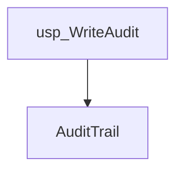
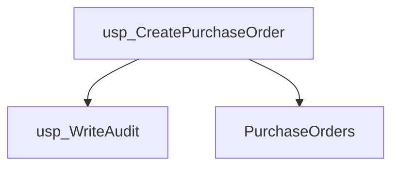
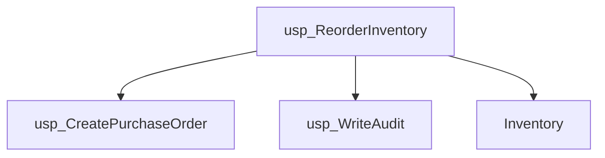
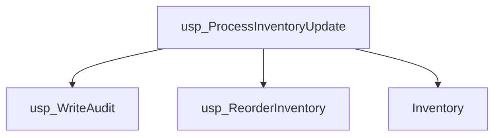
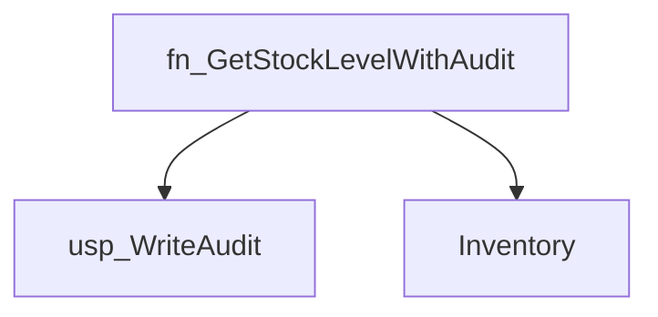
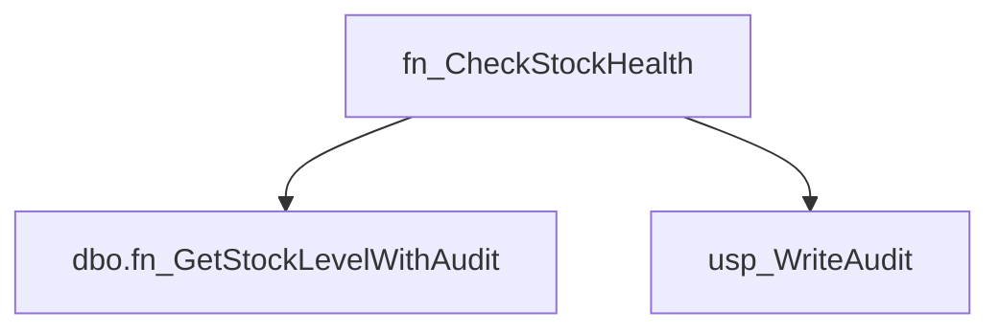
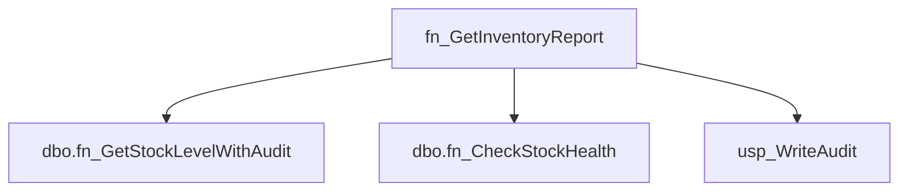
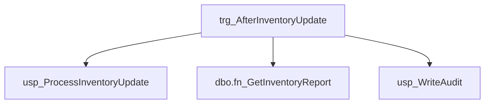
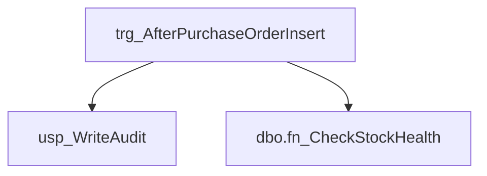

# Summary

- **Total Procedures**: 4
- **Total Functions**: 3
- **Total Triggers**: 2
- **Total Tables**: 3
- **Most Called Object**: `usp_WriteAudit`

---

# Table of Contents

- Procedure: [usp_WriteAudit](#usp_writeaudit)
- Procedure: [usp_CreatePurchaseOrder](#usp_createpurchaseorder)
- Procedure: [usp_ReorderInventory](#usp_reorderinventory)
- Procedure: [usp_ProcessInventoryUpdate](#usp_processinventoryupdate)
- Function: [fn_GetStockLevelWithAudit](#fn_getstocklevelwithaudit)
- Function: [fn_CheckStockHealth](#fn_checkstockhealth)
- Function: [fn_GetInventoryReport](#fn_getinventoryreport)
- Trigger: [trg_AfterInventoryUpdate](#trg_afterinventoryupdate)
- Trigger: [trg_AfterPurchaseOrderInsert](#trg_afterpurchaseorderinsert)

---

## Procedure: usp_WriteAudit

---

### Parameters

| Name | Type |
|------|------|
| @eventType | VARCHAR(50) |
| @details | VARCHAR(200) |

---

### Tables

- AuditTrail

---

### Calls

---

### Call Graph

---

### Business Logic

The stored procedure `usp_WriteAudit` logs audit events to the `AuditTrail` table.  It accepts an event type and details as input parameters (`@@eventType`, `@@details`) and records this information in the audit log, providing a record of system activities for auditing and troubleshooting purposes.

---

## Procedure: usp_CreatePurchaseOrder

---

### Parameters

| Name | Type |
|------|------|
| @itemId | INT |
| @quantity | INT |

---

### Tables

- PurchaseOrders

---

### Calls

- usp_WriteAudit

---

### Call Graph

---

### Business Logic

The stored procedure `usp_CreatePurchaseOrder` creates a new purchase order record in the `PurchaseOrders` table.  It accepts the item ID (`@@itemId`) and quantity (`@@quantity`) as input parameters to specify the item being ordered and the number of units required.  The procedure's functionality is to record this purchase order request within the system's database.  Note that the provided SQL code is empty, so further details on error handling or additional logic cannot be provided.

---

## Procedure: usp_ReorderInventory

---

### Parameters

| Name | Type |
|------|------|
| @itemId | INT |

---

### Tables

- Inventory

---

### Calls

- usp_CreatePurchaseOrder
- usp_WriteAudit

---

### Call Graph

---

### Business Logic

The stored procedure `usp_ReorderInventory` automatically triggers a reorder for a specific item identified by `@@itemId` based on predefined inventory thresholds within the `Inventory` table.  The exact reorder logic (e.g., quantity to order) is not evident from the provided information but is implicitly defined within the procedure's missing SQL code.

---

## Procedure: usp_ProcessInventoryUpdate

---

### Parameters

| Name | Type |
|------|------|
| @itemId | INT |
| @adjustment | INT |

---

### Tables

- Inventory

---

### Calls

- usp_WriteAudit
- usp_ReorderInventory

---

### Call Graph

---

### Business Logic

The stored procedure `usp_ProcessInventoryUpdate` adjusts the inventory count for a given item.  It accepts the item ID (`@@itemId`) and the quantity adjustment (`@@adjustment`) as input parameters.  The procedure updates the `Inventory` table to reflect this change, increasing or decreasing the stock level depending on the sign of the `@@adjustment` value.

---

## Function: fn_GetStockLevelWithAudit

---

### Parameters

| Name | Type |
|------|------|
| @itemId | INT |

---

### Tables

- Inventory

---

### Calls

- usp_WriteAudit

---

### Call Graph

---

### Business Logic

The function fn_GetStockLevelWithAudit retrieves the current stock level for a given item ID (@@itemId) from the Inventory table.  The "With Audit" implies that it likely includes information related to the audit trail or history of stock level changes, though the provided SQL code lacks detail to confirm the specifics of this audit information.

---

## Function: fn_CheckStockHealth

---

### Parameters

| Name | Type |
|------|------|
| @itemId | INT |

---

### Tables

---

### Calls

- dbo.fn_GetStockLevelWithAudit
- usp_WriteAudit

---

### Call Graph

---

### Business Logic

The function fn_CheckStockHealth,  currently lacking implementation details, is intended to assess the health or status of stock for a given item identified by the @@itemId parameter.  Without the SQL code, the specific metrics used to determine stock health are unknown, but it presumably analyzes relevant data (not specified in the provided context) to provide an overall assessment of the item's stock situation.

---

## Function: fn_GetInventoryReport

---

### Parameters

| Name | Type |
|------|------|
| @itemId | INT |

---

### Tables

---

### Calls

- dbo.fn_GetStockLevelWithAudit
- dbo.fn_CheckStockHealth
- usp_WriteAudit

---

### Call Graph

---

### Business Logic

The function fn_GetInventoryReport is incomplete and lacks a SQL definition, therefore its business logic cannot be determined.  No tables are referenced, and no code is provided to define how inventory data is accessed or processed.  Further information is required to describe its intended business function.

---

## Trigger: trg_AfterInventoryUpdate

---

### Tables

---

### Calls

- usp_ProcessInventoryUpdate
- dbo.fn_GetInventoryReport
- usp_WriteAudit

---

### Call Graph

---

### Business Logic

The trigger `trg_AfterInventoryUpdate` is currently undefined and has no associated business logic.  It lacks any SQL code, table references, or parameters, indicating that it has not yet been implemented or is incomplete.

---

## Trigger: trg_AfterPurchaseOrderInsert

---

### Tables

---

### Calls

- usp_WriteAudit
- dbo.fn_CheckStockHealth

---

### Call Graph

---

### Business Logic

The trigger `trg_AfterPurchaseOrderInsert` is currently undefined and does not contain any business logic.  It lacks associated tables and SQL code, indicating it is either a placeholder or an incomplete object requiring further definition to implement any post-purchase order insertion processing.

---

