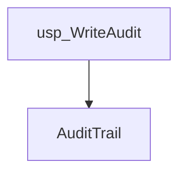
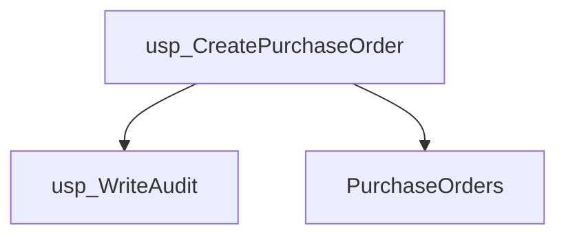
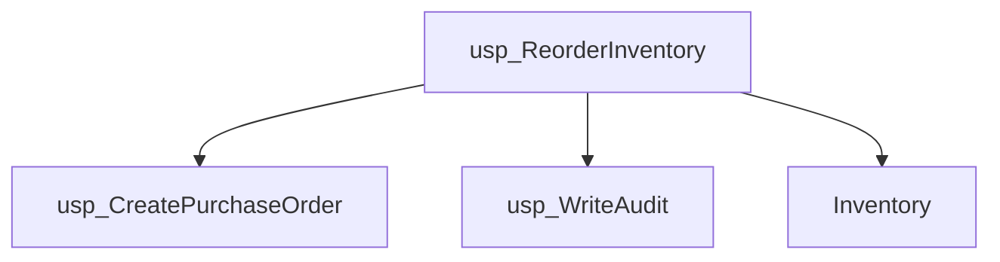
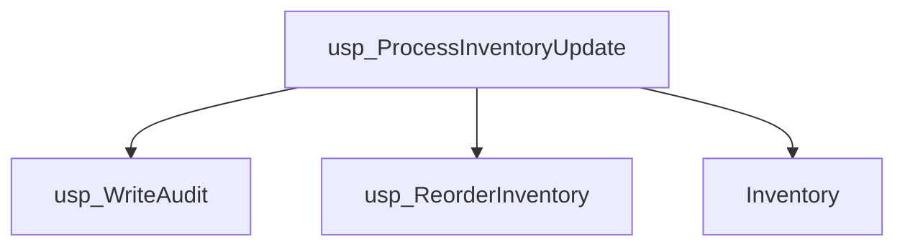
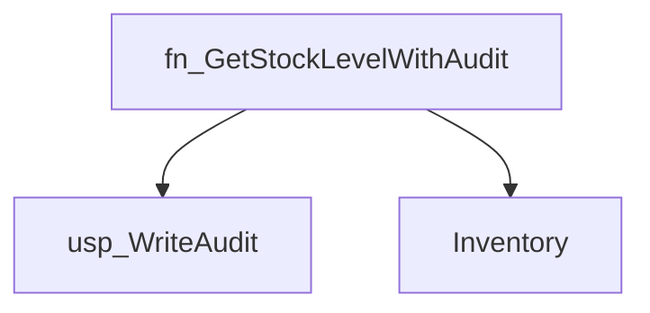
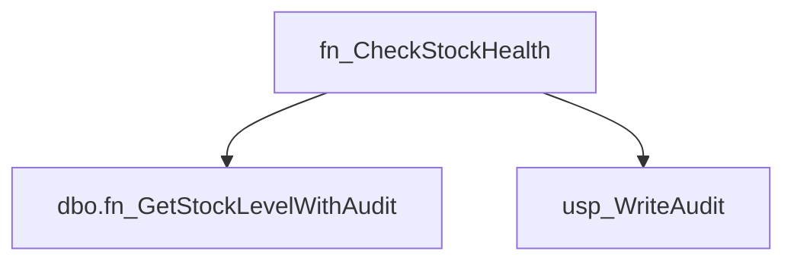
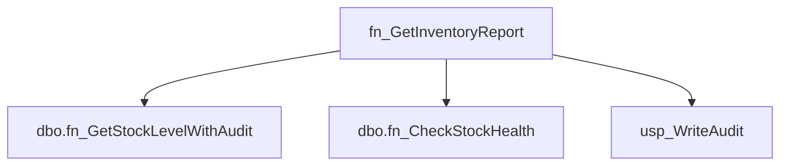
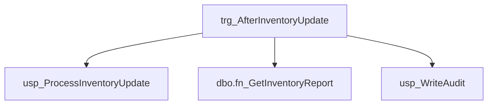
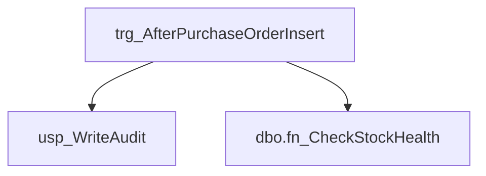

# Summary

- **Total Procedures**: 4
- **Total Functions**: 3
- **Total Triggers**: 2
- **Total Tables**: 3
- **Most Called Object**: `usp_WriteAudit`

---

# Table of Contents

- Procedure: [usp_WriteAudit](#usp_writeaudit)
- Procedure: [usp_CreatePurchaseOrder](#usp_createpurchaseorder)
- Procedure: [usp_ReorderInventory](#usp_reorderinventory)
- Procedure: [usp_ProcessInventoryUpdate](#usp_processinventoryupdate)
- Function: [fn_GetStockLevelWithAudit](#fn_getstocklevelwithaudit)
- Function: [fn_CheckStockHealth](#fn_checkstockhealth)
- Function: [fn_GetInventoryReport](#fn_getinventoryreport)
- Trigger: [trg_AfterInventoryUpdate](#trg_afterinventoryupdate)
- Trigger: [trg_AfterPurchaseOrderInsert](#trg_afterpurchaseorderinsert)

---

## Procedure: usp_WriteAudit

---

### Parameters

| Name | Type |
|------|------|
| @eventType | VARCHAR(50) |
| @details | VARCHAR(200) |

---

### Tables

- AuditTrail

---

### Calls

---

### Call Graph

---

### Business Logic

Description could not be generated due to an OpenRouter API error: 401 Client Error: Unauthorized for url: https://openrouter.ai/api/v1/chat/completions

---

## Procedure: usp_CreatePurchaseOrder

---

### Parameters

| Name | Type |
|------|------|
| @itemId | INT |
| @quantity | INT |

---

### Tables

- PurchaseOrders

---

### Calls

- usp_WriteAudit

---

### Call Graph

---

### Business Logic

Description could not be generated due to an OpenRouter API error: 401 Client Error: Unauthorized for url: https://openrouter.ai/api/v1/chat/completions

---

## Procedure: usp_ReorderInventory

---

### Parameters

| Name | Type |
|------|------|
| @itemId | INT |

---

### Tables

- Inventory

---

### Calls

- usp_CreatePurchaseOrder
- usp_WriteAudit

---

### Call Graph

---

### Business Logic

Description could not be generated due to an OpenRouter API error: 401 Client Error: Unauthorized for url: https://openrouter.ai/api/v1/chat/completions

---

## Procedure: usp_ProcessInventoryUpdate

---

### Parameters

| Name | Type |
|------|------|
| @itemId | INT |
| @adjustment | INT |

---

### Tables

- Inventory

---

### Calls

- usp_WriteAudit
- usp_ReorderInventory

---

### Call Graph

---

### Business Logic

Description could not be generated due to an OpenRouter API error: 401 Client Error: Unauthorized for url: https://openrouter.ai/api/v1/chat/completions

---

## Function: fn_GetStockLevelWithAudit

---

### Parameters

| Name | Type |
|------|------|
| @itemId | INT |

---

### Tables

- Inventory

---

### Calls

- usp_WriteAudit

---

### Call Graph

---

### Business Logic

Description could not be generated due to an OpenRouter API error: 401 Client Error: Unauthorized for url: https://openrouter.ai/api/v1/chat/completions

---

## Function: fn_CheckStockHealth

---

### Parameters

| Name | Type |
|------|------|
| @itemId | INT |

---

### Tables

---

### Calls

- dbo.fn_GetStockLevelWithAudit
- usp_WriteAudit

---

### Call Graph

---

### Business Logic

Description could not be generated due to an OpenRouter API error: 401 Client Error: Unauthorized for url: https://openrouter.ai/api/v1/chat/completions

---

## Function: fn_GetInventoryReport

---

### Parameters

| Name | Type |
|------|------|
| @itemId | INT |

---

### Tables

---

### Calls

- dbo.fn_GetStockLevelWithAudit
- dbo.fn_CheckStockHealth
- usp_WriteAudit

---

### Call Graph

---

### Business Logic

Description could not be generated due to an OpenRouter API error: 401 Client Error: Unauthorized for url: https://openrouter.ai/api/v1/chat/completions

---

## Trigger: trg_AfterInventoryUpdate

---

### Tables

---

### Calls

- usp_ProcessInventoryUpdate
- dbo.fn_GetInventoryReport
- usp_WriteAudit

---

### Call Graph

---

### Business Logic

Description could not be generated due to an OpenRouter API error: 401 Client Error: Unauthorized for url: https://openrouter.ai/api/v1/chat/completions

---

## Trigger: trg_AfterPurchaseOrderInsert

---

### Tables

---

### Calls

- usp_WriteAudit
- dbo.fn_CheckStockHealth

---

### Call Graph

---

### Business Logic

Description could not be generated due to an OpenRouter API error: 401 Client Error: Unauthorized for url: https://openrouter.ai/api/v1/chat/completions

---

