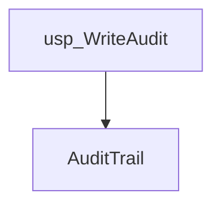
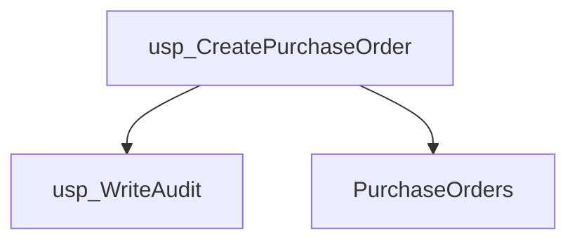
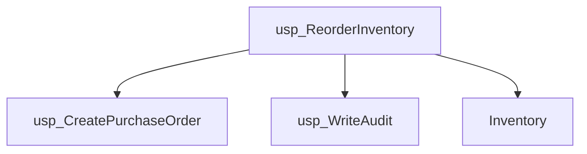
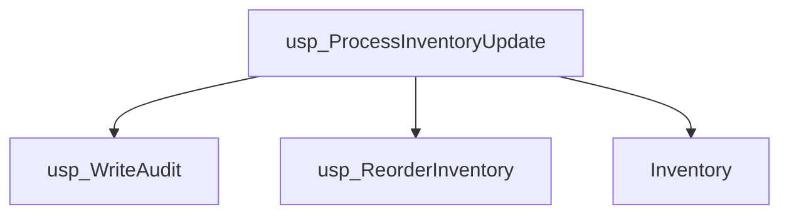
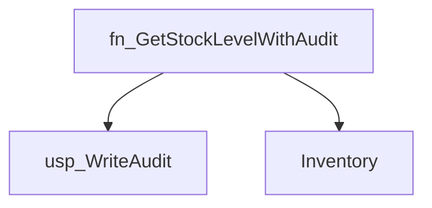
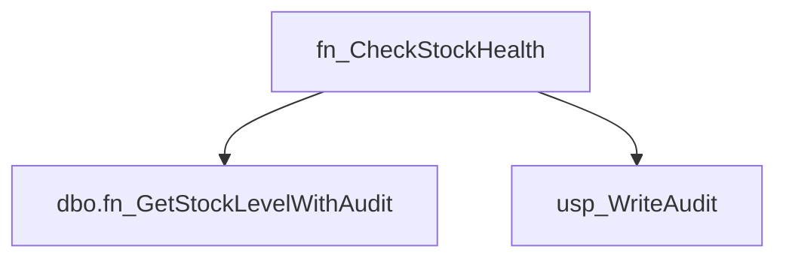
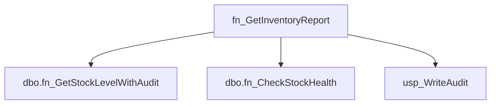
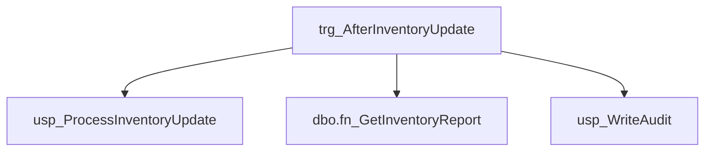
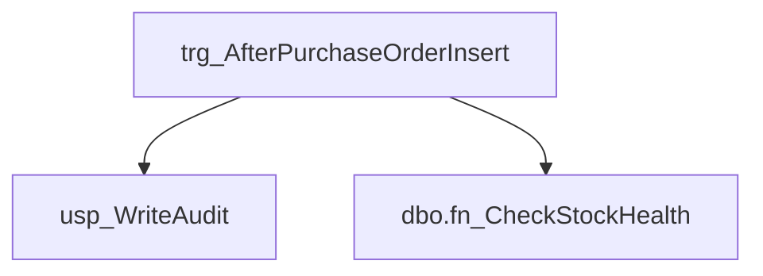

# Summary

- **Total Procedures**: 4
- **Total Functions**: 3
- **Total Triggers**: 2
- **Total Tables**: 3
- **Most Called Object**: `usp_WriteAudit`

---

# Table of Contents

- Procedure: [usp_WriteAudit](#usp_writeaudit)
- Procedure: [usp_CreatePurchaseOrder](#usp_createpurchaseorder)
- Procedure: [usp_ReorderInventory](#usp_reorderinventory)
- Procedure: [usp_ProcessInventoryUpdate](#usp_processinventoryupdate)
- Function: [fn_GetStockLevelWithAudit](#fn_getstocklevelwithaudit)
- Function: [fn_CheckStockHealth](#fn_checkstockhealth)
- Function: [fn_GetInventoryReport](#fn_getinventoryreport)
- Trigger: [trg_AfterInventoryUpdate](#trg_afterinventoryupdate)
- Trigger: [trg_AfterPurchaseOrderInsert](#trg_afterpurchaseorderinsert)

---

## Procedure: usp_WriteAudit

---

### Parameters

| Name | Type |
|------|------|
| @eventType | VARCHAR(50) |
| @details | VARCHAR(200) |

---

### Tables

- AuditTrail

---

### Calls

---

### Call Graph

---

### Business Logic

The stored procedure `usp_WriteAudit` logs audit events to the `AuditTrail` table.  It accepts the event type and details as input parameters (`@@eventType` and `@@details`) and records this information in a new row within the `AuditTrail` table, thereby providing a record of system activity for auditing and tracking purposes.

---

## Procedure: usp_CreatePurchaseOrder

---

### Parameters

| Name | Type |
|------|------|
| @itemId | INT |
| @quantity | INT |

---

### Tables

- PurchaseOrders

---

### Calls

- usp_WriteAudit

---

### Call Graph

---

### Business Logic

The stored procedure `usp_CreatePurchaseOrder` creates a new purchase order record in the `PurchaseOrders` table.  It takes the item ID (`@@itemId`) and quantity (`@@quantity`) as input parameters to specify the item and the number of units to be ordered.  The procedure's logic is currently undefined, requiring further specification to determine how it handles potential errors (e.g., insufficient stock, invalid item ID) and how it populates other fields in the `PurchaseOrders` table (e.g., order date, supplier, total cost).

---

## Procedure: usp_ReorderInventory

---

### Parameters

| Name | Type |
|------|------|
| @itemId | INT |

---

### Tables

- Inventory

---

### Calls

- usp_CreatePurchaseOrder
- usp_WriteAudit

---

### Call Graph

---

### Business Logic

The stored procedure `usp_ReorderInventory` automatically initiates a reorder for a given item identified by `@@itemId` based on the inventory levels stored in the `Inventory` table.  The specific reorder logic (thresholds, quantities, etc.) is not evident from the provided information but is presumably contained within the missing SQL code.

---

## Procedure: usp_ProcessInventoryUpdate

---

### Parameters

| Name | Type |
|------|------|
| @itemId | INT |
| @adjustment | INT |

---

### Tables

- Inventory

---

### Calls

- usp_WriteAudit
- usp_ReorderInventory

---

### Call Graph

---

### Business Logic

The stored procedure `usp_ProcessInventoryUpdate` adjusts the quantity of a specific inventory item.  It takes the item ID (`@@itemId`) and the adjustment amount (`@@adjustment`) as input, updating the corresponding record in the `Inventory` table to reflect the change.  A positive `@@adjustment` value increases the inventory count, while a negative value decreases it.

---

## Function: fn_GetStockLevelWithAudit

---

### Parameters

| Name | Type |
|------|------|
| @itemId | INT |

---

### Tables

- Inventory

---

### Calls

- usp_WriteAudit

---

### Call Graph

---

### Business Logic

The function fn_GetStockLevelWithAudit retrieves the current stock level for a given item ID (@@itemId) from the Inventory table.  The inclusion of "Audit" in the function name suggests that it likely incorporates audit trail information related to stock level changes, although the provided SQL code lacks detail to specify the exact nature or scope of this audit information.

---

## Function: fn_CheckStockHealth

---

### Parameters

| Name | Type |
|------|------|
| @itemId | INT |

---

### Tables

---

### Calls

- dbo.fn_GetStockLevelWithAudit
- usp_WriteAudit

---

### Call Graph

---

### Business Logic

The function fn_CheckStockHealth, given an item ID (@@itemId), lacks defined SQL code and therefore does not currently perform any business logic.  Its intended purpose is presumably to assess the health or status of a given item's stock levels, but without implementation details this remains undefined.

---

## Function: fn_GetInventoryReport

---

### Parameters

| Name | Type |
|------|------|
| @itemId | INT |

---

### Tables

---

### Calls

- dbo.fn_GetStockLevelWithAudit
- dbo.fn_CheckStockHealth
- usp_WriteAudit

---

### Call Graph

---

### Business Logic

The function fn_GetInventoryReport, which lacks provided SQL code and table references, is intended to retrieve an inventory report.  Presumably, the @@itemId parameter is used to filter the report to show inventory information for a specific item.  Without the SQL code, the exact nature of the report (e.g., quantity on hand, location, etc.) and the data source remain undefined.

---

## Trigger: trg_AfterInventoryUpdate

---

### Tables

---

### Calls

- usp_ProcessInventoryUpdate
- dbo.fn_GetInventoryReport
- usp_WriteAudit

---

### Call Graph

---

### Business Logic

The trigger `trg_AfterInventoryUpdate` is currently undefined and does not perform any business logic.  It lacks any SQL code, indicating that no actions are taken after an inventory update.

---

## Trigger: trg_AfterPurchaseOrderInsert

---

### Tables

---

### Calls

- usp_WriteAudit
- dbo.fn_CheckStockHealth

---

### Call Graph

---

### Business Logic

The trigger `trg_AfterPurchaseOrderInsert` is currently undefined and has no associated business logic.  It is not yet implemented and therefore does not perform any actions upon insertion of purchase orders.

---

