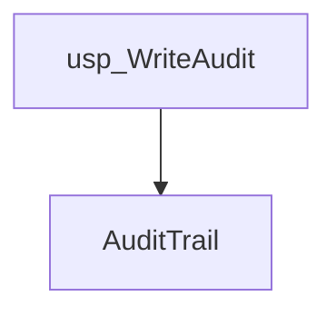
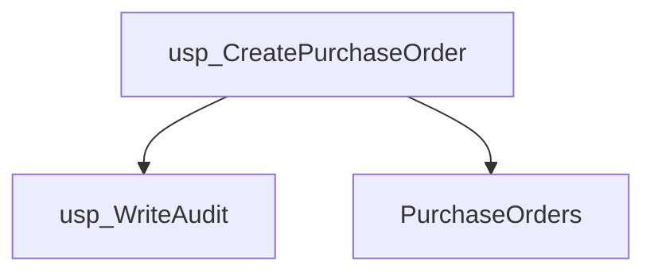
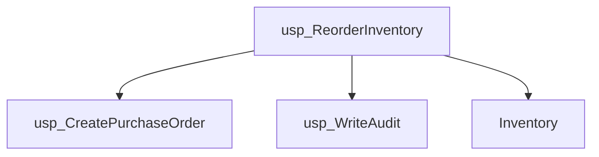
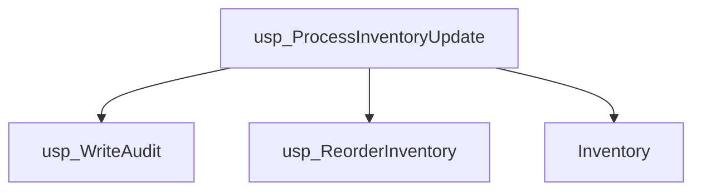
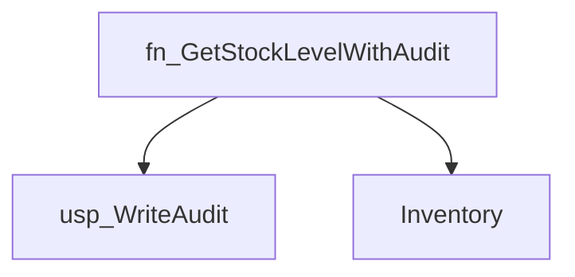
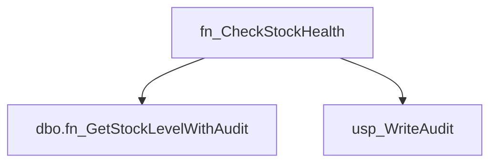
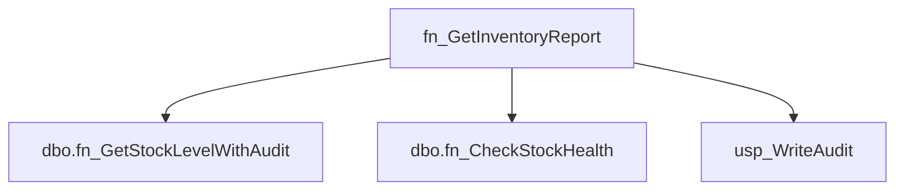
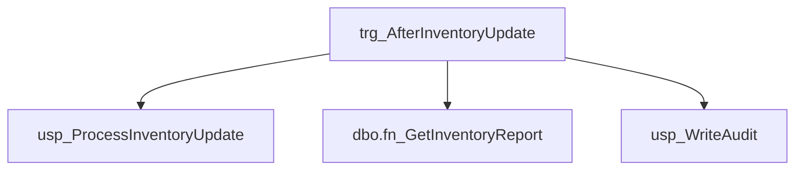
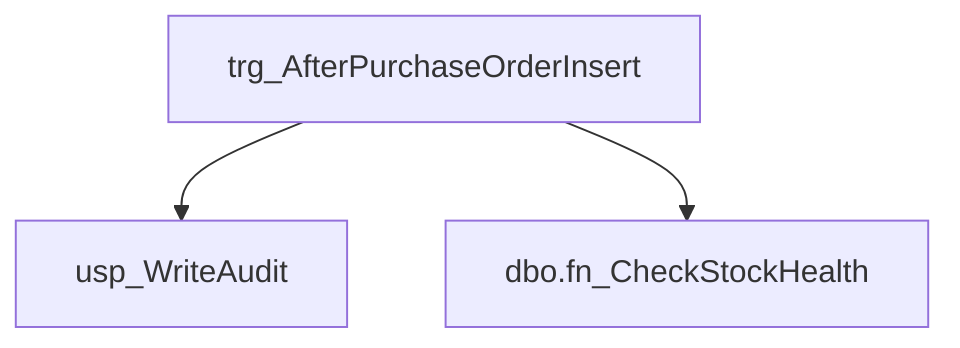

# Summary

- **Total Procedures**: 4
- **Total Functions**: 3
- **Total Triggers**: 2
- **Total Tables**: 3
- **Most Called Object**: `usp_WriteAudit`

---

# Table of Contents

- Procedure: [usp_WriteAudit](#usp_writeaudit)
- Procedure: [usp_CreatePurchaseOrder](#usp_createpurchaseorder)
- Procedure: [usp_ReorderInventory](#usp_reorderinventory)
- Procedure: [usp_ProcessInventoryUpdate](#usp_processinventoryupdate)
- Function: [fn_GetStockLevelWithAudit](#fn_getstocklevelwithaudit)
- Function: [fn_CheckStockHealth](#fn_checkstockhealth)
- Function: [fn_GetInventoryReport](#fn_getinventoryreport)
- Trigger: [trg_AfterInventoryUpdate](#trg_afterinventoryupdate)
- Trigger: [trg_AfterPurchaseOrderInsert](#trg_afterpurchaseorderinsert)

---

## Procedure: usp_WriteAudit

---

### Parameters

| Name | Type |
|------|------|
| @eventType | VARCHAR(50) |
| @details | VARCHAR(200) |

---

### Tables

- AuditTrail

---

### Calls

---

### Call Graph

---

### Business Logic

Overall Purpose:
1. The primary business goal of the usp_WriteAudit stored procedure is to log audit trail information related to different events happening within the business system.

Process Breakdown:
2. This procedure automates the process of inserting a new record into the AuditTrail table whenever an event occurs that requires auditing. The @eventType parameter specifies the type of event that occurred (e.g., login, logout, data update), and the @details parameter provides additional information or context about the event. The procedure then inserts this information into the AuditTrail table, capturing a history of all significant system actions.

Key Business Rules:
3. The main business rule embedded in this logic is to ensure that all important system events are recorded for auditing purposes. By logging the event type and details, the business can maintain a secure and transparent system, allowing for traceability and accountability in case of any issues or discrepancies.

Inputs and Outputs:
4. Inputs: 
- @eventType: A string value that represents the type of event that occurred.
- @details: A string value that provides additional information about the event.

Outputs:
- The procedure does not return any direct output to the user interface. Instead, it inserts a new record into the AuditTrail table, capturing the @eventType and @details for auditing purposes.

---

## Procedure: usp_CreatePurchaseOrder

---

### Parameters

| Name | Type |
|------|------|
| @itemId | INT |
| @quantity | INT |

---

### Tables

- PurchaseOrders

---

### Calls

- usp_WriteAudit

---

### Call Graph

---

### Business Logic

Overall Purpose:
The primary business goal of this procedure is to create a new purchase order in the system for a specific item with a given quantity.

Process Breakdown:
1. The procedure takes two inputs: @itemId (the unique identifier of the item being ordered) and @quantity (the quantity of the item being ordered).
2. It then inserts a new record into the PurchaseOrders table with the provided @itemId, @quantity, and a default status of 'OPEN'.
3. After creating the purchase order record, the procedure calls another stored procedure (usp_WriteAudit) to log an audit trail entry indicating that a purchase order has been created for the specified item and quantity.

Key Business Rules:
- The purchase order is always created with an initial status of 'OPEN', indicating that it is a new order that has not been processed yet.
- The procedure generates an audit trail entry for every purchase order created, helping to track the history of order creation and changes in the system.

Inputs and Outputs:
Inputs:
- @itemId: The unique identifier of the item being ordered.
- @quantity: The quantity of the item being ordered.

Outputs:
- Creation of a new purchase order record in the PurchaseOrders table with the provided item ID, quantity, and status.
- An audit trail entry indicating the creation of the purchase order for tracking and monitoring purposes.

---

## Procedure: usp_ReorderInventory

---

### Parameters

| Name | Type |
|------|------|
| @itemId | INT |

---

### Tables

- Inventory

---

### Calls

- usp_CreatePurchaseOrder
- usp_WriteAudit

---

### Call Graph

---

### Business Logic

Overall Purpose:
1. The primary business goal of this procedure is to automate the process of reordering inventory items when their quantity falls below a predefined reorder level.

Process Breakdown:
2. This procedure first retrieves the current quantity and reorder level of a specific inventory item identified by its ItemID.
3. It then checks if the current quantity is less than the reorder level.
4. If the quantity is indeed lower than the reorder level, the procedure triggers the creation of a purchase order to replenish the stock by the difference between the reorder level and the current quantity.
5. Additionally, an audit log entry is written to track the reorder action for future reference.

Key Business Rules:
6. The key business rule embedded in this logic is that inventory items need to be reordered when their quantity falls below a certain level to ensure that there are always enough items in stock to meet demand.

Inputs and Outputs:
7. Inputs:
   - ItemID: The specific identifier of the inventory item for which the reorder check is being performed.

8. Outputs:
   - Purchase Order: If the inventory needs to be reordered, a purchase order is created to replenish the stock.
   - Audit Log Entry: An audit log entry is generated to document the reorder action for tracking and monitoring purposes.

---

## Procedure: usp_ProcessInventoryUpdate

---

### Parameters

| Name | Type |
|------|------|
| @itemId | INT |
| @adjustment | INT |

---

### Tables

- Inventory

---

### Calls

- usp_WriteAudit
- usp_ReorderInventory

---

### Call Graph

---

### Business Logic

Overall Purpose:
1. The primary business goal of this stored procedure is to update the inventory quantity of a specific item in the Inventory table and track the update in an audit log. Additionally, it triggers a reorder check for the item to maintain optimal inventory levels.

Process Breakdown:
2. 
    a. The procedure takes two input parameters: @itemId (the ID of the item to be updated) and @adjustment (the quantity adjustment to be made).
    b. It updates the Quantity column in the Inventory table by adding the @adjustment value to the existing quantity for the specified @itemId.
    c. The LastUpdated column in the Inventory table is updated with the current date and time using the GETDATE() function.
    d. An audit log entry is created by calling the usp_WriteAudit stored procedure, indicating the type of update ('INVENTORY_UPDATE'), the specific item adjusted, and the quantity adjustment made.
    e. A nested call is made to the usp_ReorderInventory stored procedure to check if the updated quantity triggers a reorder action for the item.

Key Business Rules:
3. 
    a. Inventory quantity adjustments are made directly to the existing quantity for the specified item.
    b. The LastUpdated column in the Inventory table is updated with the current date and time for tracking purposes.
    c. An audit log entry is generated for every inventory update to maintain a record of changes.
    d. The reorder check is triggered after each inventory update to ensure optimal inventory levels are maintained.

Inputs and Outputs:
4. 
    Inputs:
    - @itemId: The ID of the item in the Inventory table to be updated.
    - @adjustment: The quantity adjustment to be made for the specified item.

    Outputs:
    - The Quantity column in the Inventory table is updated with the adjusted quantity.
    - An audit log entry is created to track the inventory update action.
    - The usp_ReorderInventory procedure may generate outputs related to reorder actions based on the updated quantity.

---

## Function: fn_GetStockLevelWithAudit

---

### Parameters

| Name | Type |
|------|------|
| @itemId | INT |

---

### Tables

- Inventory

---

### Calls

- usp_WriteAudit

---

### Call Graph

---

### Business Logic

Overall Purpose:
The primary business goal of this stored procedure is to retrieve the stock level (quantity) of a specific item from the Inventory table and log this action in an audit trail.

Process Breakdown:
1. The procedure takes an input parameter, which is the ItemID of the item for which we want to retrieve the stock level.
2. It then queries the Inventory table to fetch the Quantity of the item corresponding to the provided ItemID.
3. The Quantity value is stored in a variable @qty.
4. It then calls another stored procedure usp_WriteAudit to log the event of calling this function, along with the ItemID for which the stock level was retrieved.
5. Finally, the procedure returns the @qty value, which represents the stock level of the requested item.

Key Business Rules:
- The main business rule embedded in this logic is to ensure that the stock level of an item is accurately retrieved and recorded for audit purposes.
- The audit trail is crucial for tracking when and by whom the stock levels of items are accessed, providing transparency and accountability in inventory management.

Inputs and Outputs:
Inputs:
- The stored procedure requires an input parameter, which is the ItemID (unique identifier) of the item for which the stock level needs to be retrieved.

Outputs:
- The procedure returns the stock level (Quantity) of the specified item as an output, which can be used for various inventory management and reporting purposes. Additionally, the audit log entry is created to track the retrieval of this information.

---

## Function: fn_CheckStockHealth

---

### Parameters

| Name | Type |
|------|------|
| @itemId | INT |

---

### Tables

---

### Calls

- dbo.fn_GetStockLevelWithAudit
- usp_WriteAudit

---

### Call Graph

---

### Business Logic

**Overall Purpose:**
The primary business goal of this procedure is to check the stock health of a particular item and flag it as "LOW" if the stock level is below 10 units.

**Process Breakdown:**
1. The procedure takes the item ID as input.
2. It calls another function, fn_GetStockLevelWithAudit, to retrieve the current stock quantity of the item.
3. If the stock quantity is less than 10, the status is set to "LOW" and an audit entry is written using the usp_WriteAudit stored procedure.

**Key Business Rules:**
- If the stock quantity of an item falls below 10 units, it is considered to be in low stock.
- An audit entry is made whenever an item is flagged as low stock to track when and why the status changed.

**Inputs and Outputs:**
- **Inputs:** The procedure requires the item ID as input to check its stock health.
- **Output:** The output of the procedure is a status message indicating whether the item is in "LOW" stock or not. Additionally, an audit entry is created to record the status change for the item.

---

## Function: fn_GetInventoryReport

---

### Parameters

| Name | Type |
|------|------|
| @itemId | INT |

---

### Tables

---

### Calls

- dbo.fn_GetStockLevelWithAudit
- dbo.fn_CheckStockHealth
- usp_WriteAudit

---

### Call Graph

---

### Business Logic

**Overall Purpose:**
The primary business goal of this procedure is to generate an inventory report for a specific item. The report includes information such as the item ID, quantity in stock, and the health status of the stock.

**Process Breakdown:**
1. The procedure takes the item ID as input.
2. It then calls two separate functions to retrieve the stock level and stock health for the specified item.
3. The stock level and stock health are then combined to create a comprehensive report for the item.
4. An audit entry is created to log the generation of the report.
5. The report is returned as the output of the procedure.

**Key Business Rules:**
- The report includes the item ID, quantity in stock, and the health status of the stock.
- The audit entry is created every time a report is generated for an item.

**Inputs and Outputs:**
- **Inputs:** The procedure requires the item ID as input to generate the inventory report.
- **Outputs:** The procedure produces a formatted report including the item ID, quantity in stock, and the health status of the stock.

---

## Trigger: trg_AfterInventoryUpdate

---

### Tables

---

### Calls

- usp_ProcessInventoryUpdate
- dbo.fn_GetInventoryReport
- usp_WriteAudit

---

### Call Graph

---

### Business Logic

**Overall Purpose:**
The primary business goal of this stored procedure is to automate certain actions that need to be taken after an update is made to the Inventory table in the database.

**Process Breakdown:**
1. The trigger is activated after an update is made to the Inventory table.
2. It retrieves the ItemID of the updated record from the INSERTED pseudo table.
3. It then calls a master stored procedure, usp_ProcessInventoryUpdate, passing the ItemID and a default value of 0.
4. Next, it calls a nested function, dbo.fn_GetInventoryReport, passing the ItemID to get a report related to the updated inventory item.
5. Finally, it logs the update action by calling another stored procedure, usp_WriteAudit, which records the trigger action and the details of the updated inventory item.

**Key Business Rules:**
- This trigger is set to execute after an update operation on the Inventory table to ensure that specific actions are taken consistently whenever inventory data is modified.
- The trigger calls a master stored procedure to process the inventory update and a nested function to generate a report, ensuring that all relevant information is captured and processed accordingly.
- The trigger logs the update action using a separate stored procedure, maintaining a record of all inventory updates for auditing and tracking purposes.

**Inputs and Outputs:**
- *Inputs*: The trigger does not require any external parameters but retrieves the ItemID from the updated record in the Inventory table.
- *Outputs*: The trigger generates a log entry that includes details of the inventory update action for auditing purposes. The report generated by the nested function may also be considered as an output, providing additional insights into the updated inventory item.

---

## Trigger: trg_AfterPurchaseOrderInsert

---

### Tables

---

### Calls

- usp_WriteAudit
- dbo.fn_CheckStockHealth

---

### Call Graph

---

### Business Logic

Overall Purpose:
1. The primary business goal of this stored procedure is to automate actions that need to be taken after a new purchase order is inserted into the PurchaseOrders table in the database. This includes logging audit information and checking the stock health of the purchased item.

Process Breakdown:
2. Step-by-step business process:
   a. Upon insertion of a new purchase order, the trigger fires and retrieves the ItemID and Quantity of the newly inserted record from the INSERTED table.
   b. The trigger then calls a stored procedure, usp_WriteAudit, to log an audit entry detailing the new purchase order. This helps in tracking and monitoring the purchase activities.
   c. Next, the trigger calls a user-defined function, dbo.fn_CheckStockHealth, to check the stock health of the purchased item based on its ItemID. This is crucial for ensuring that the inventory levels are adequate to fulfill the order.
   d. Another audit entry is logged to record the health status of the item in the purchase order trigger.

Key Business Rules:
3. Important business rules:
   - The trigger is designed to execute after each new purchase order is inserted, ensuring that necessary actions are taken promptly.
   - The audit entries provide a trail of activities related to purchase orders, aiding in accountability and transparency.
   - Checking the stock health helps in maintaining inventory levels and preventing stockouts or overstock situations.

Inputs and Outputs:
4. Inputs:
   - The trigger does not require any explicit inputs from the user. It automatically fetches the ItemID and Quantity from the newly inserted purchase order.
   Outputs:
   - The trigger generates audit entries that include details of the new purchase order and the stock health status of the purchased item. These outputs serve as a record of the transaction and help in monitoring inventory levels.

---

