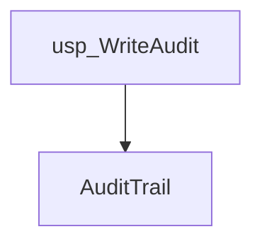
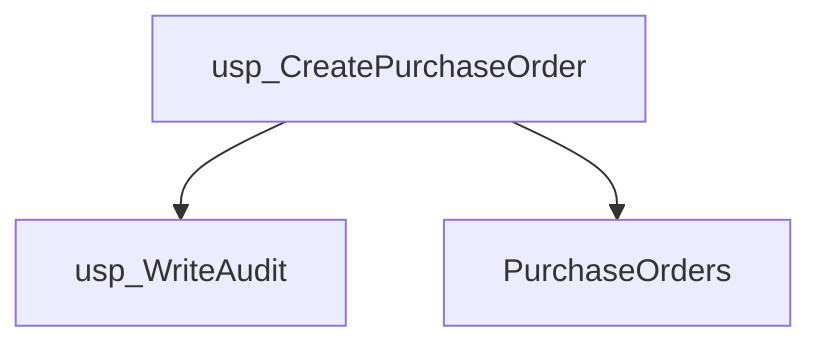
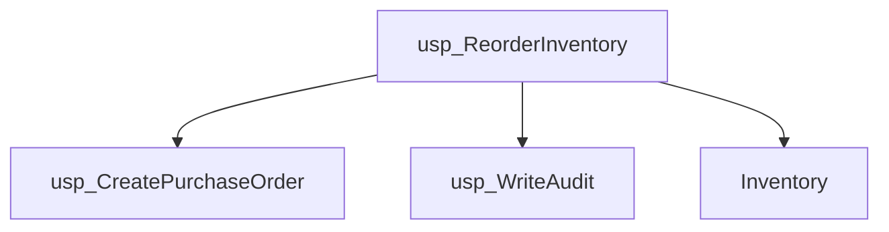
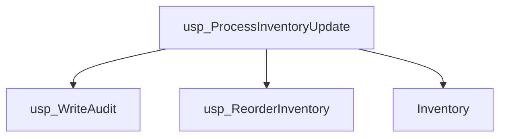
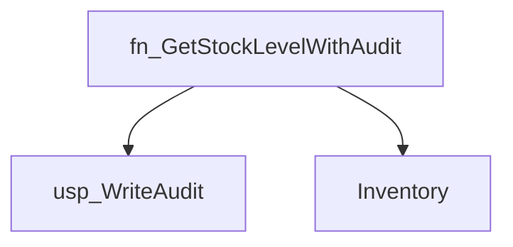
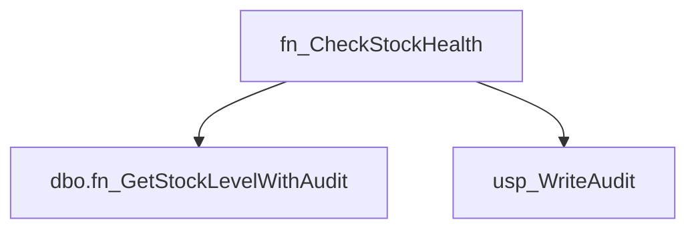
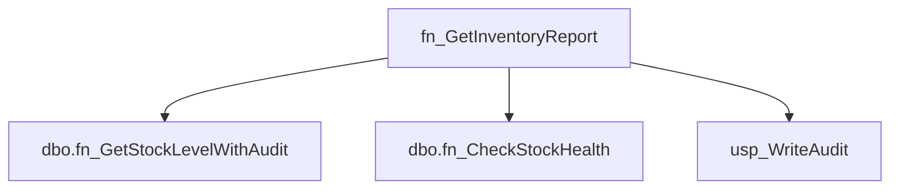
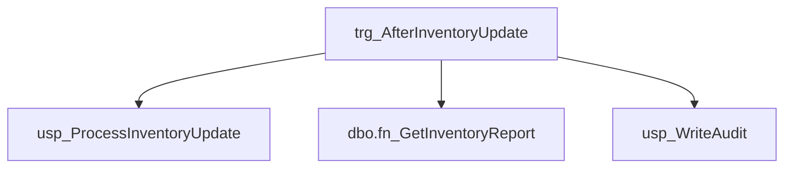
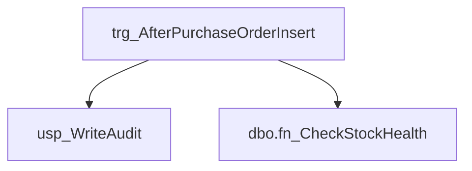

# Summary

- **Total Procedures**: 4
- **Total Functions**: 3
- **Total Triggers**: 2
- **Total Tables**: 3
- **Most Called Object**: `usp_WriteAudit`

---

# Table of Contents

- Procedure: [usp_WriteAudit](#usp_writeaudit)
- Procedure: [usp_CreatePurchaseOrder](#usp_createpurchaseorder)
- Procedure: [usp_ReorderInventory](#usp_reorderinventory)
- Procedure: [usp_ProcessInventoryUpdate](#usp_processinventoryupdate)
- Function: [fn_GetStockLevelWithAudit](#fn_getstocklevelwithaudit)
- Function: [fn_CheckStockHealth](#fn_checkstockhealth)
- Function: [fn_GetInventoryReport](#fn_getinventoryreport)
- Trigger: [trg_AfterInventoryUpdate](#trg_afterinventoryupdate)
- Trigger: [trg_AfterPurchaseOrderInsert](#trg_afterpurchaseorderinsert)

---

## Procedure: usp_WriteAudit

---

### Parameters

| Name | Type |
|------|------|
| @eventType | VARCHAR(50) |
| @details | VARCHAR(200) |

---

### Tables

- AuditTrail

---

### Calls

---

### Call Graph

---

### Business Logic

Overall Purpose:  
The primary business goal of the stored procedure named `usp_WriteAudit` is to record and maintain a log of specific events or actions that occur within a business system. This procedure ensures that there is a reliable audit trail for tracking the history of certain operations, which is crucial for compliance, security, and performance monitoring. By capturing these events, the business can conduct reviews, investigations, or analyses to ensure accountability and transparency in its processes.

Process Breakdown:  
1. **Event Logging Trigger**: Whenever a particular event occurs within the business system that needs to be recorded, this stored procedure is triggered. This could be due to a transaction completion, a change in data, or any predefined significant action within the system.

2. **Data Insertion**: The procedure takes the event type and details about the event as input parameters. It then automatically inserts these details into the `AuditTrail` table. This table acts as a repository for all logged events, capturing the nature and specifics of each action.

3. **Data Flow**: The flow of information is straightforward. Once the procedure is invoked, the input data (event type and details) is transferred directly into the `AuditTrail` table, ensuring the information is stored accurately and promptly.

Key Business Rules:  
1. **Event Documentation**: Every event that is deemed necessary for logging must be passed to this procedure with two pieces of information: the type of event and the detailed description. This enforces a structured approach to capturing events, ensuring consistency in how events are documented.

2. **Data Integrity**: By using a stored procedure to handle the logging, the business ensures that all event records are inserted in a controlled manner, reducing the risk of errors or inconsistencies that could arise from manual data entry.

Inputs and Outputs:  
- **Inputs**: The procedure requires two inputs to function:
  1. `@eventType` (a short description of the type of event, such as "LOGIN", "UPDATE", etc.), which should be a string with a maximum of 50 characters.
  2. `@details` (a more detailed description of the event), which should be a string with a maximum of 200 characters.

- **Outputs**: The procedure does not directly produce any outputs in terms of return values. However, its output is the successful insertion of a new record into the `AuditTrail` table, which contains the provided event type and details. This acts as a permanent record for future reference and analysis.

---

## Procedure: usp_CreatePurchaseOrder

---

### Parameters

| Name | Type |
|------|------|
| @itemId | INT |
| @quantity | INT |

---

### Tables

- PurchaseOrders

---

### Calls

- usp_WriteAudit

---

### Call Graph

---

### Business Logic

1. Overall Purpose:
The primary business goal of the stored procedure `usp_CreatePurchaseOrder` is to automate the process of creating a new purchase order within the company's system. This procedure facilitates the ordering of items by capturing essential details such as the item being ordered and the quantity required, ensuring that the procurement process is initiated efficiently and accurately. By doing so, it helps maintain inventory levels and supports the fulfillment of customer or operational demands.

2. Process Breakdown:
   - The procedure begins by inserting a new record into the `PurchaseOrders` table. This record includes the item identifier (`ItemID`), the quantity to be ordered (`Quantity`), and sets the status of the order to 'OPEN'. This step is crucial as it officially logs a new purchase order in the system, marking it as pending fulfillment.
   - Following the creation of the purchase order, an audit entry is generated by executing another procedure, `usp_WriteAudit`. This action records a log entry specifying that a purchase order has been created, including details about the item and quantity ordered. This audit trail is important for maintaining transparency and accountability in the procurement process, allowing for future review and tracking of orders.

3. Key Business Rules:
   - Every time a purchase order is created, it is automatically assigned a status of 'OPEN'. This indicates that the order is active and awaiting further processing, such as supplier confirmation or delivery.
   - An audit entry is mandatory for each purchase order creation. This ensures that all actions related to purchase orders are documented, supporting both operational oversight and compliance with any regulatory requirements regarding record-keeping.

4. Inputs and Outputs:
   - Inputs: The procedure requires two key pieces of information to run: the item identifier (`@itemId`) and the order quantity (`@quantity`). These inputs specify what item is being ordered and in what quantity, which are critical for the accurate recording of purchase orders.
   - Outputs: The procedure outputs a new entry in the `PurchaseOrders` table with the specified item and quantity, and an 'OPEN' status. Additionally, it generates an audit log entry documenting the creation of the purchase order. These outputs are essential for tracking and managing the company's procurement activities.

---

## Procedure: usp_ReorderInventory

---

### Parameters

| Name | Type |
|------|------|
| @itemId | INT |

---

### Tables

- Inventory

---

### Calls

- usp_CreatePurchaseOrder
- usp_WriteAudit

---

### Call Graph

---

### Business Logic

1. Overall Purpose:
The primary business goal of the "usp_ReorderInventory" stored procedure is to ensure that inventory levels for specific items are maintained at an optimal level to prevent stockouts. This procedure is designed to automatically initiate the reordering process when inventory for an item falls below a predefined threshold, known as the reorder level. This helps the business maintain a continuous supply chain, meet customer demands, and avoid potential revenue loss due to unavailable products.

2. Process Breakdown:
   - The procedure begins by accepting a single input parameter, '@itemId', which uniquely identifies the inventory item that needs to be checked.
   - It declares two local variables, '@qty' and '@reorderLevel', to store the current quantity of the item in stock and its reorder level, respectively.
   - The procedure retrieves the current quantity and reorder level from the 'Inventory' table for the specified item ID.
   - It then compares the current quantity '@qty' with the '@reorderLevel'. If the quantity is less than the reorder level, it indicates that the item is running low and needs to be reordered.
   - Upon determining that a reorder is necessary, the procedure calls another stored procedure, 'usp_CreatePurchaseOrder', to create a purchase order for the amount needed to bring the inventory back up to the reorder level.
   - Additionally, it logs the reorder action by executing 'usp_WriteAudit', recording the event for future reference and auditing purposes. This step helps in maintaining a transparent and trackable inventory management system.

3. Key Business Rules:
   - Reorder Threshold: The procedure enforces a rule where an item is only reordered if its quantity falls below its designated reorder level. This ensures that resources are not unnecessarily tied up in excess inventory.
   - Automated Reordering: The process of reordering is automated, reducing manual intervention and the risk of human error in maintaining inventory levels.
   - Audit Logging: Every reorder action is documented, providing a traceable record of inventory management decisions, which supports accountability and helps in future inventory analysis.

4. Inputs and Outputs:
   - Inputs: The procedure requires a single input - the '@itemId', which identifies the specific inventory item to be checked.
   - Outputs: The direct outputs of the procedure are the actions triggered from within. It produces a purchase order when a reorder is necessary and logs an audit record of the reorder event. These actions ensure that the inventory is replenished and that the process is documented for accountability.

---

## Procedure: usp_ProcessInventoryUpdate

---

### Parameters

| Name | Type |
|------|------|
| @itemId | INT |
| @adjustment | INT |

---

### Tables

- Inventory

---

### Calls

- usp_WriteAudit
- usp_ReorderInventory

---

### Call Graph

---

### Business Logic

1. Overall Purpose:
The primary business goal of the stored procedure `usp_ProcessInventoryUpdate` is to manage and maintain accurate inventory levels for a business. It ensures that any adjustments to the inventory quantities are correctly updated in the system, records the change for audit purposes, and triggers a check to determine if more stock needs to be ordered based on the updated inventory levels. This helps the business maintain optimal inventory levels, preventing both overstock and stockouts.

2. Process Breakdown:
- **Step 1: Inventory Adjustment:** The procedure begins by updating the inventory record for a specific item identified by `@itemId`. The quantity of this item is adjusted by the value provided in `@adjustment`. This step ensures that the inventory database reflects any changes due to sales, returns, new stock arrivals, or other inventory-related transactions.
- **Step 2: Audit Logging:** After adjusting the inventory, the procedure records this change by calling another procedure, `usp_WriteAudit`. This logs the adjustment details including the item ID and the amount of change. This step is crucial for maintaining a history of inventory changes for accountability and traceability.
- **Step 3: Reorder Check:** Finally, the procedure calls `usp_ReorderInventory`, which likely checks whether the updated quantity falls below a certain threshold that would necessitate reordering more stock. This proactive step helps ensure that inventory is replenished in a timely manner, supporting uninterrupted operations.

3. Key Business Rules:
- **Inventory Adjustment Rule:** The quantity for a specific item is adjusted by a given amount, which could be positive (adding to stock) or negative (reducing stock).
- **Audit Requirement:** Every inventory adjustment must be logged for audit purposes. This ensures transparency and accountability in inventory management.
- **Reorder Trigger:** After every inventory adjustment, a check is performed to determine if more of the item needs to be ordered. This helps maintain optimal stock levels, avoiding both excess inventory and shortages.

4. Inputs and Outputs:
- **Inputs:** The procedure requires two inputs: `@itemId` (the identifier for the inventory item to be adjusted) and `@adjustment` (the numerical value representing the change in inventory quantity, which can be positive or negative).
- **Outputs:** The primary output is the updated inventory level for the specified item in the database. Additionally, an audit entry is created to log the adjustment, and potentially, a reorder action may be initiated if the updated inventory level warrants it.

---

## Function: fn_GetStockLevelWithAudit

---

### Parameters

| Name | Type |
|------|------|
| @itemId | INT |

---

### Tables

- Inventory

---

### Calls

- usp_WriteAudit

---

### Call Graph

---

### Business Logic

Overall Purpose:
The primary business goal of the function `fn_GetStockLevelWithAudit` is to retrieve the current stock level of a specific item from the inventory. Additionally, it aims to maintain an audit trail of access to this information. This ensures that any retrieval of stock levels is recorded for accountability and tracking purposes, which can be crucial for inventory management and operational transparency.

Process Breakdown:
1. The function starts by declaring a variable `@qty` to hold the quantity of the item from the inventory.
2. It executes a query against the `Inventory` table to select the current `Quantity` of the item identified by `@itemId` and assigns this value to the `@qty` variable.
3. An audit entry is created by calling another process (`usp_WriteAudit`) with information that includes the type of action ('FUNCTION_CALL') and a message indicating that the function was called for a specific item. This step is important for tracking who accessed the inventory information and when.
4. Finally, the function returns the quantity of the item, providing the required stock level information to the requester.

Key Business Rules:
1. Each access to the stock level must be audited. This is achieved by writing an entry to the audit log whenever the function is called. This business rule ensures that there is a record of each time stock information is accessed, which is important for security and operational integrity.
2. The function only retrieves the stock level for a single item at a time, identified by `@itemId`. This ensures that the process is focused and efficient, preventing unnecessary data retrieval and processing.

Inputs and Outputs:
Inputs:
- The function requires one input: `@itemId`, which is the unique identifier of the item whose stock level is being queried. This input ensures that the function retrieves the correct and specific inventory data.

Outputs:
- The function outputs the current stock level (`@qty`) for the specified item. This output provides the necessary information for decision-making related to inventory management, such as restocking, sales forecasting, and supply chain logistics.

---

## Function: fn_CheckStockHealth

---

### Parameters

| Name | Type |
|------|------|
| @itemId | INT |

---

### Tables

---

### Calls

- dbo.fn_GetStockLevelWithAudit
- usp_WriteAudit

---

### Call Graph

---

### Business Logic

1. Overall Purpose:
The primary business goal of this function, `fn_CheckStockHealth`, is to monitor and ensure the availability of stock items by assessing their inventory levels. It is designed to quickly identify items that are running low in stock and trigger alerts when necessary. This helps the business maintain optimal stock levels, prevent stockouts, and ensure that customer demand can be consistently met.

2. Process Breakdown:
- The function begins by taking an input parameter, `@itemId`, which represents the unique identifier of a stock item.
- It then declares two variables: `@qty` to store the quantity of the item in stock, and `@status` to store the stock health status.
- The function calls another function, `dbo.fn_GetStockLevelWithAudit`, passing the `@itemId` as an argument to retrieve the current stock level of the specified item. The result is stored in the `@qty` variable.
- A conditional check (`IF` statement) is performed to determine if the stock level (`@qty`) is less than 10 units.
- If the stock level is found to be less than 10, the `@status` is set to 'LOW', indicating a low stock situation.
- To ensure accountability and traceability, the function then calls a stored procedure, `usp_WriteAudit`, to log this event. The log entry contains the category 'STOCK_HEALTH' and a message indicating that the item has been flagged as low in stock.

3. Key Business Rules:
- The function establishes a critical business rule: an item is considered to have a 'LOW' stock status if its quantity falls below 10 units. This threshold is likely based on historical data, lead times for restocking, or business policy to trigger early replenishment actions.
- The function is designed to automatically initiate an audit trail when an item is flagged as low. This ensures that all stock health checks are documented, providing transparency and allowing for historical analysis of inventory management practices.

4. Inputs and Outputs:
- Inputs: The function requires a single input, `@itemId`, which is the identifier for the stock item whose health is being checked.
- Outputs: The function produces a status output as a string, which can be 'LOW' if the stock is below the defined threshold. Additionally, it logs an audit entry to document the low stock event, though this audit entry itself is not a direct output of the function in terms of return value.

---

## Function: fn_GetInventoryReport

---

### Parameters

| Name | Type |
|------|------|
| @itemId | INT |

---

### Tables

---

### Calls

- dbo.fn_GetStockLevelWithAudit
- dbo.fn_CheckStockHealth
- usp_WriteAudit

---

### Call Graph

---

### Business Logic

Overall Purpose:
The primary business goal of the `fn_GetInventoryReport` function is to generate a concise report for a specific inventory item. This report provides critical information about the item's current stock level and its health status, which are essential for inventory management and decision-making processes. The function serves to streamline the reporting process, ensuring that stakeholders have access to up-to-date and accurate inventory data, thereby supporting efficient inventory control and strategic planning.

Process Breakdown:
1. The function begins by declaring three variables: `@qty` to hold the quantity of the item in stock, `@health` to store the health status of the item, and `@report` to construct and store the final report string.
2. The current stock level of the item is retrieved using an internal function `fn_GetStockLevelWithAudit`, which takes the item ID as input. This value is stored in the `@qty` variable. This step is critical for understanding how much of the item is available and if it meets current demand.
3. The health status of the item is evaluated using another internal function `fn_CheckStockHealth`. This assessment might consider factors like turnover rates, expiration dates, or other quality metrics. The result is stored in the `@health` variable. Knowing the health status helps determine if the item is in a usable state or if any action is needed to address potential issues.
4. The function then constructs a report string by combining the item ID, quantity, and health status into a readable format. This string is stored in the `@report` variable.
5. An audit trail is maintained by executing the `usp_WriteAudit` procedure. This logs the generation of the report, helping maintain accountability and tracking for inventory management activities.
6. Finally, the constructed report string is returned, providing a snapshot of the item's status to the requesting process or user.

Key Business Rules:
- The function must retrieve and report the current stock level of an item, ensuring accurate inventory data for decision-making.
- The health status of the item is evaluated and included in the report, ensuring that the quality of inventory is monitored and maintained.
- An audit entry is made whenever a report is generated, ensuring that all inventory report activities are tracked for compliance and review purposes.

Inputs and Outputs:
Inputs: The function requires a single input, `@itemId`, which represents the unique identifier of the inventory item for which the report is generated. This ensures that the function retrieves and reports data specific to the item of interest.
Outputs: The function outputs a formatted string containing the item ID, its current quantity in stock, and its health status. This output provides a concise yet comprehensive overview of the item's inventory status, aiding in inventory management and operational decisions.

---

## Trigger: trg_AfterInventoryUpdate

---

### Tables

---

### Calls

- usp_ProcessInventoryUpdate
- dbo.fn_GetInventoryReport
- usp_WriteAudit

---

### Call Graph

---

### Business Logic

1. Overall Purpose:
The primary purpose of the `trg_AfterInventoryUpdate` trigger is to ensure that any changes made to the inventory are immediately processed and logged for auditing and reporting purposes. This trigger ensures that after any update to the inventory, the system automatically processes the updated information, generates a report, and logs the event for accountability and tracking. This helps maintain data integrity and provides a clear audit trail for inventory changes.

2. Process Breakdown:
- **Trigger Activation**: The trigger activates automatically whenever there is an update to the `Inventory` table. This ensures that no manual intervention is needed to initiate the process.
- **Extracting Updated Item**: The trigger retrieves the `ItemID` of the updated inventory item from the `INSERTED` table, which is a temporary table holding the new values of the updated rows.
- **Processing Inventory Update**: It calls the stored procedure `usp_ProcessInventoryUpdate` with the `ItemID` and a parameter value of `0`. This procedure likely updates related data or performs necessary business logic to reflect the inventory change. The use of `0` as a parameter could denote a specific processing type or condition.
- **Generating Report**: Next, it calls a function `fn_GetInventoryReport` with the updated `ItemID`. This function generates a detailed report about the inventory item, which may include its current status, changes, and other relevant information.
- **Logging the Update**: Finally, the trigger logs the update action by calling `usp_WriteAudit`. It records the event type ('TRIGGER'), a description that includes the `ItemID`, and the report created. This step ensures there is a permanent record of the change for auditing and monitoring purposes.

3. Key Business Rules:
- Every inventory update must be processed immediately to reflect the most current data and ensure consistency across the system.
- A report must be generated for every updated item to provide detailed insights and support decision-making.
- Each update action must be logged for transparency, traceability, and compliance with auditing requirements.

4. Inputs and Outputs:
- **Inputs**: The primary input is the `ItemID` of the inventory item that has been updated. This is used to identify which item needs processing and reporting.
- **Outputs**: The outputs include the processing of the inventory update, the generation of an inventory report, and the creation of an audit log entry. These outputs ensure data integrity, provide insights, and maintain an audit trail of changes to the inventory.

---

## Trigger: trg_AfterPurchaseOrderInsert

---

### Tables

---

### Calls

- usp_WriteAudit
- dbo.fn_CheckStockHealth

---

### Call Graph

---

### Business Logic

Overall Purpose:
The primary business goal of the trigger "trg_AfterPurchaseOrderInsert" is to enhance the monitoring and management of inventory levels in real-time, specifically following the insertion of a new purchase order. This is achieved by automatically logging audit information and checking the stock status of items involved in the purchase order. By doing so, the business ensures better inventory control and timely insights into stock health, which can aid in decision-making and maintaining optimal inventory levels.

Process Breakdown:
1. Trigger Activation: The trigger is activated immediately after a new purchase order is inserted into the PurchaseOrders table. This ensures that any new order will automatically initiate this process without manual intervention.

2. Data Extraction: The trigger extracts the ItemID and Quantity from the newly inserted purchase order. This is necessary to identify which item and how many units have been ordered.

3. Audit Logging: The procedure logs an audit entry with a message indicating that a new purchase order has been processed for a specific item and quantity. This helps maintain a record of all purchase activities for accountability and tracking purposes.

4. Stock Health Check: The trigger calls a function, fn_CheckStockHealth, to assess the current stock health of the ordered item. The result is stored in a variable.

5. Stock Health Logging: Another audit entry is created to log the stock health status of the item. This provides immediate feedback on whether the item is in a healthy stock state following the order, which can trigger further actions if necessary.

Key Business Rules:
1. Every new purchase order insertion must trigger an audit log entry. This ensures traceability and transparency for all purchase transactions.
2. A stock health check is mandatory for every item in a new purchase order. This rule ensures that the inventory system proactively monitors stock levels and identifies potential issues early.
3. The stock health status must be logged to provide a historical record of inventory conditions, which can be useful for future analysis and reporting.

Inputs and Outputs:
Inputs: The procedure requires information about the newly inserted purchase order, specifically the ItemID and Quantity from the PurchaseOrders table.
Outputs: The procedure produces audit log entries containing details about the purchase order and the stock health status of the item. These outputs are crucial for maintaining comprehensive records and ensuring informed inventory management decisions.

---

