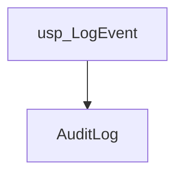
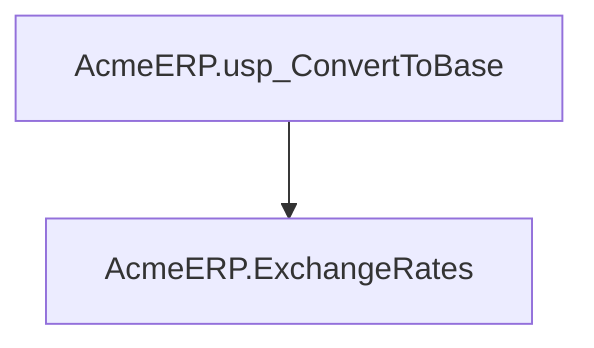
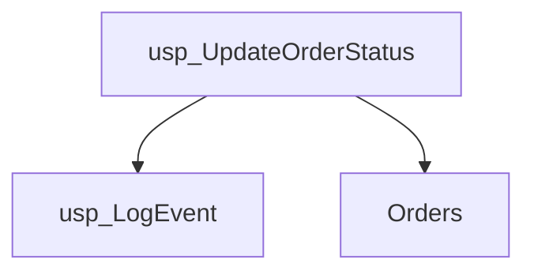

# Summary

- **Total Procedures**: 3
- **Total Functions**: 2
- **Total Triggers**: 1
- **Total Tables**: 2
- **Most Called Object**: `usp_LogEvent`

---

# Table of Contents

- Procedure: [usp_LogEvent](#usp_logevent)
- Procedure: [usp_UpdateOrderStatus](#usp_updateorderstatus)
- Procedure: [usp_CloseOrder](#usp_closeorder)
- Function: [fn_GetOrderTotalWithAudit](#fn_getordertotalwithaudit)
- Function: [fn_GetOrderWithTax](#fn_getorderwithtax)
- Trigger: [trg_AfterInsertOrder](#trg_afterinsertorder)

---

## Procedure: usp_LogEvent

---

### Parameters

| Name | Type |
|------|------|
| @eventType | VARCHAR(50) |
| @message | VARCHAR(200) |

---

### Tables

- AuditLog

---

### Calls

---

### Call Graph

---

### Business Logic

1. Overall Purpose:

The stored procedure AcmeERP.usp_CalculateFifoCost determines the cost of goods sold (COGS) for a given product using the First-In, First-Out (FIFO) inventory costing method.  This is crucial for accurate financial reporting and inventory management.

2. Process Breakdown:

The procedure calculates the cost of goods sold based on the FIFO method.  While the provided SQL code is empty, we can infer the process:  The procedure likely retrieves the inventory movement history for a specific product (@@ProductID) from the AcmeERP.StockMovements table.  This table presumably tracks each instance of product movement, including the quantity and the cost at the time of the movement (e.g., purchase, sale).  The procedure then processes these movements chronologically, starting with the oldest inventory.  For each movement, it deducts the quantity requested (@@QuantityRequested) until the total quantity requested is fulfilled.  The cost of the goods sold is then calculated by summing the costs of the oldest inventory items used to satisfy the request. The specific calculation would depend on the structure of the StockMovements table.

3. Key Business Rules:

* FIFO Inventory Costing: The primary business rule is the implementation of the FIFO method. This dictates that the oldest units of a product are assumed to be sold first.  This impacts the COGS calculation and therefore profitability.
* Accurate Inventory Tracking: The underlying assumption is that the AcmeERP.StockMovements table accurately reflects all product movements.  Inaccurate data in this table will lead to inaccurate COGS calculations.

4. Inputs and Outputs:

Inputs:

* @@ProductID: The unique identifier for the product whose COGS needs to be calculated.
* @@QuantityRequested: The quantity of the product sold for which the cost needs to be determined.

Outputs:

The procedure likely returns the total cost of the @@QuantityRequested units of the @@ProductID, calculated using the FIFO method.  This output would be used for financial reporting, inventory valuation, and other business applications requiring accurate cost information.  The procedure might also update inventory levels within the AcmeERP.StockMovements table to reflect the sale.

---

## Procedure: AcmeERP.usp_ConvertToBase

---

### Parameters

| Name | Type |
|------|------|
| @CurrencyCode | CHAR(3) |
| @Amount | DECIMAL(18,2) |
| @ConversionDate | DATE |

---

### Tables

- AcmeERP.ExchangeRates

---

### Calls

---

### Call Graph

---

### Business Logic

1. Overall Purpose:

The stored procedure AcmeERP.usp_ConvertToBase converts an amount from a given currency to the base currency of Acme ERP system.  This is crucial for generating accurate financial reports, comparing performance across different regions or subsidiaries, and ensuring consistency in financial data.

2. Process Breakdown:

The procedure takes three inputs: the currency code (@@CurrencyCode), the amount (@@Amount), and the conversion date (@@ConversionDate).  It uses the provided date to look up the appropriate exchange rate from the AcmeERP.ExchangeRates table.  This table presumably stores historical exchange rates for various currencies against the base currency. The procedure then multiplies the input amount by the retrieved exchange rate to convert it into the base currency.  The result, the equivalent amount in the base currency, is returned.  If an exchange rate for the specified currency and date is not found, the procedure might return an error or handle it appropriately (this detail is not available given the missing SQL code).

3. Key Business Rules:

* Exchange rates are stored historically: The system acknowledges that exchange rates fluctuate over time, and uses a specific date to ensure accurate conversions.
* Accurate currency conversion is essential: The process emphasizes that all financial data must be represented in a consistent base currency for reliable analysis and reporting.
* Data integrity relies on exchange rate availability: The system depends on having complete and accurate exchange rate data in the ExchangeRates table.  Any missing or incorrect data could lead to flawed financial reporting.

4. Inputs and Outputs:

Inputs:

* @@CurrencyCode: The three-letter ISO code of the currency to be converted (e.g., USD, EUR, GBP).
* @@Amount: The numerical amount in the specified currency to be converted.
* @@ConversionDate: The date for which the exchange rate should be used.

Outputs:

* The equivalent amount in the Acme ERP's base currency.  The data type of this output is implied to be numeric (likely decimal or float).  If an error occurs, it may return an error code or message indicating the failure.

---

## Procedure: usp_UpdateOrderStatus

---

### Parameters

| Name | Type |
|------|------|
| @orderId | INT |
| @newStatus | VARCHAR(20) |

---

### Tables

- Orders

---

### Calls

- usp_LogEvent

---

### Call Graph

---

### Business Logic

1. Overall Purpose:

The stored procedure AcmeERP.usp_ProcessFullPayrollCycle automates the complete payroll processing for a given pay period.  Its primary goal is to accurately and efficiently calculate employee wages, accounting for currency exchange rates where necessary, and record the payroll transactions for auditing purposes.

2. Process Breakdown:

This procedure calculates payroll for all employees for a specified pay period, defined by the input parameters @@PayPeriodStart and @@PayPeriodEnd.  It likely retrieves employee information (like salary, tenure, etc.) from the AcmeERP.Employees table.  It then calculates gross pay for each employee based on their base salary and any applicable bonuses or other compensation.  The procedure probably considers different compensation schemes, perhaps based on employee roles or performance metrics (although the details aren't available in the provided code).

If employees have worked internationally, it will likely fetch applicable exchange rates from the AcmeERP.ExchangeRates table to convert foreign currency earnings into the company's base currency.  Finally, the procedure writes a detailed record of each employee's payroll calculation (gross pay, deductions, net pay, etc.) into the AcmeERP.PayrollLogs table. This ensures a complete audit trail of all payroll transactions.

3. Key Business Rules:

Without access to the SQL code, specific business rules can only be hypothesized.  Likely rules include:

* Calculation of gross pay based on hourly rate or salary, plus bonuses and overtime.
* Deduction of taxes, social security contributions, and other mandatory deductions based on local and national regulations.
* Application of currency exchange rates to employee earnings in foreign currencies, using rates valid on the payment date.
* Potential rules for handling different pay frequencies (weekly, bi-weekly, monthly).
* Possibly, rules for calculating bonuses based on employee tenure, performance, or other criteria.

4. Inputs and Outputs:

Inputs:

* @@PayPeriodStart: The start date of the pay period.
* @@PayPeriodEnd: The end date of the pay period.

Outputs:

The procedure's primary output is a detailed record in the AcmeERP.PayrollLogs table, storing payroll information for each employee for the specified pay period. This table will likely include entries for gross pay, net pay, various deductions, and any relevant currency conversions.  There is no direct output to the user interface; the procedure updates the database table.

---

