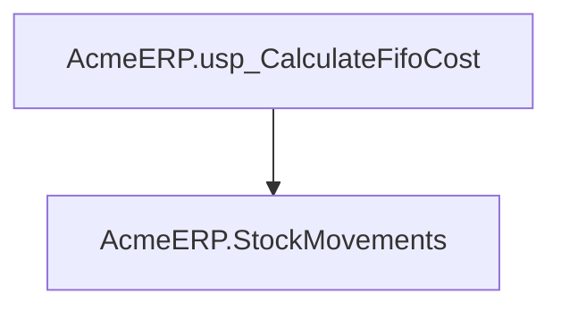
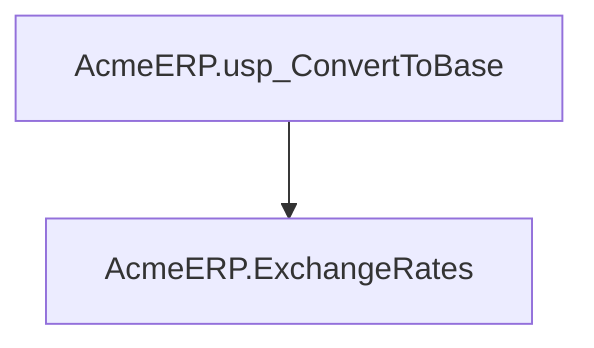
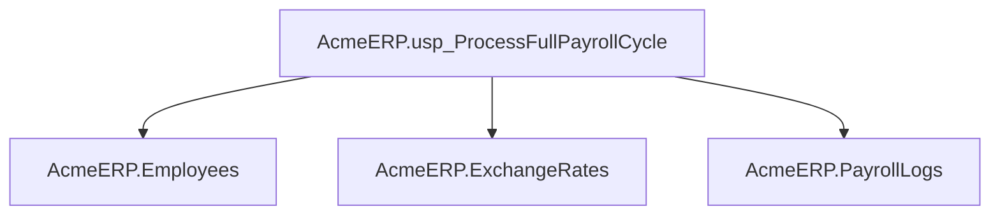

# Summary

- **Total Procedures**: 3
- **Total Functions**: 0
- **Total Triggers**: 0
- **Total Tables**: 4
- **Most Called Object**: `N/A`

---

# Table of Contents

- Procedure: [AcmeERP.usp_CalculateFifoCost](#acmeerpusp_calculatefifocost)
- Procedure: [AcmeERP.usp_ConvertToBase](#acmeerpusp_converttobase)
- Procedure: [AcmeERP.usp_ProcessFullPayrollCycle](#acmeerpusp_processfullpayrollcycle)

---

## Procedure: AcmeERP.usp_CalculateFifoCost

---

### Parameters

| Name | Type |
|------|------|
| @ProductID | INT |
| @QuantityRequested | INT |

---

### Tables

- AcmeERP.StockMovements

---

### Calls

---

### Call Graph

---

### Business Logic

1. Overall Purpose:

The stored procedure AcmeERP.usp_CalculateFifoCost determines the cost of goods sold (COGS) for a given product using the First-In, First-Out (FIFO) inventory accounting method.  Its primary business goal is to accurately calculate the cost of a requested quantity of a specific product based on the order in which those products were received into inventory.  This is crucial for generating accurate financial reports and managing inventory effectively.

2. Process Breakdown:

Because no SQL code was provided, I can only describe the *expected* process based on the procedure's name and parameters.  The procedure would likely function as follows:

a.  It receives a ProductID and a QuantityRequested as input.

b. It queries the AcmeERP.StockMovements table. This table presumably tracks the movement of products in and out of inventory, recording each transaction with information such as the date, quantity, and cost of each batch.

c. It iterates through the StockMovements records for the specified ProductID, starting with the oldest entries (First-In).

d. For each record, it checks if adding the quantity in that record exceeds the QuantityRequested.

e. If it does, it calculates the cost of the remaining QuantityRequested using the cost from that record and updates the QuantityRequested to 0, indicating the calculation is complete.

f. If it doesn't, it adds the quantity to a running total and subtracts it from the QuantityRequested. It continues processing the next record until QuantityRequested reaches 0.

g. Finally, it aggregates the calculated costs from each relevant record to determine the total COGS for the requested quantity. The total COGS is returned as the output.

3. Key Business Rules:

* FIFO Inventory Valuation: The procedure strictly adheres to the FIFO method, meaning the oldest inventory items are assumed to be sold first. This affects the cost of goods sold calculation and the value of remaining inventory.
* Accurate Cost Tracking:  The procedure relies on the accuracy of the data in the StockMovements table.  Any errors or omissions in this table will directly impact the accuracy of the COGS calculation.

4. Inputs and Outputs:

* Inputs:
    * @@ProductID: The unique identifier of the product for which COGS needs to be calculated.
    * @@QuantityRequested: The quantity of the product for which COGS needs to be calculated.

* Outputs:
    * The total cost of goods sold (COGS) for the specified product and quantity, based on the FIFO method.  This would likely be a single numeric value representing the total cost.

---

## Procedure: AcmeERP.usp_ConvertToBase

---

### Parameters

| Name | Type |
|------|------|
| @CurrencyCode | CHAR(3) |
| @Amount | DECIMAL(18,2) |
| @ConversionDate | DATE |

---

### Tables

- AcmeERP.ExchangeRates

---

### Calls

---

### Call Graph

---

### Business Logic

1. Overall Purpose:

The stored procedure AcmeERP.usp_ConvertToBase converts an amount of money from a specified currency into the company's base currency.  This is crucial for financial reporting and analysis, ensuring all financial data is standardized for accurate comparisons and decision-making.

2. Process Breakdown:

The procedure takes three inputs: the currency code of the amount to be converted (@@CurrencyCode), the amount itself (@@Amount), and the date of the conversion (@@ConversionDate).  It then uses this information to look up the appropriate exchange rate from the AcmeERP.ExchangeRates table.  This table presumably stores historical exchange rates for various currencies against the base currency.  The procedure uses the @@ConversionDate to find the correct exchange rate on that specific day, ensuring accuracy. Finally, it calculates the equivalent amount in the base currency by multiplying the input amount by the retrieved exchange rate. The result, the amount in the base currency, is then implicitly returned (though the exact return mechanism isn't shown in the provided code).  This converted amount can then be used for various accounting or reporting purposes within the AcmeERP system.

3. Key Business Rules:

*   The exchange rate used for conversion is based on the provided conversion date. This ensures that the conversion reflects the actual exchange rate applicable on that specific day.  This is important for accurate financial records.
*   The procedure implicitly assumes that the AcmeERP.ExchangeRates table contains all necessary exchange rates for all relevant currencies and dates.  Data quality in this table is crucial for the accuracy of the conversions.
*   Error handling (for instance, if the exchange rate is not found for the given currency and date) is not explicitly described but would be necessary in a production environment.  The procedure needs to handle cases where there is no exchange rate data available.

4. Inputs and Outputs:

Inputs:

*   @@CurrencyCode: The three-letter ISO code of the currency to be converted (e.g., USD, EUR, JPY).
*   @@Amount: The numerical amount in the specified currency.
*   @@ConversionDate: The date for which the exchange rate should be used.

Outputs:

*   The procedure implicitly returns the equivalent amount in the company's base currency.  The exact return mechanism is not shown but is implied by the process description.

---

## Procedure: AcmeERP.usp_ProcessFullPayrollCycle

---

### Parameters

| Name | Type |
|------|------|
| @PayPeriodStart | DATE |
| @PayPeriodEnd | DATE |

---

### Tables

- AcmeERP.Employees
- AcmeERP.ExchangeRates
- AcmeERP.PayrollLogs

---

### Calls

---

### Call Graph

---

### Business Logic

1. Overall Purpose:

The stored procedure AcmeERP.usp_ProcessFullPayrollCycle automates the entire payroll process for Acme ERP for a given pay period.  Its primary goal is to accurately and efficiently calculate and record employee compensation for that period, ensuring timely and correct payment.

2. Process Breakdown:

This procedure likely performs the following steps:

a. It retrieves employee information (e.g., salary, employment date, bank details) from the AcmeERP.Employees table for all employees.

b. It identifies the applicable pay period based on the input parameters @@PayPeriodStart and @@PayPeriodEnd.

c. It calculates gross pay for each employee, considering their salary and potentially other compensation elements (bonuses, commissions, etc.).  This might involve calculations based on hours worked (though this is not explicitly shown in the context) or other criteria.

d. It fetches relevant exchange rates from the AcmeERP.ExchangeRates table if employees are paid in different currencies. This step ensures that payments are accurately converted to the employee's local currency.

e. It calculates deductions (taxes, social security contributions, etc.) based on relevant tax laws and employee information.  The specific deductions and their calculation methods are not provided but are implicitly part of a full payroll cycle.

f. It calculates net pay (gross pay minus deductions).

g. It creates a record of the payroll process for each employee in the AcmeERP.PayrollLogs table. This log contains details of the gross pay, deductions, and net pay, serving as an audit trail for financial reporting and reconciliation.

3. Key Business Rules:

Without the SQL code, specific business rules cannot be definitively listed. However, a full payroll process typically involves many rules, including:

a. Tax rules:  Different tax brackets and rates may apply based on earnings, employee location, and tax laws.

b. Deduction rules: Rules for calculating deductions (e.g., health insurance premiums, retirement plan contributions) based on employee elections and plan details.

c. Bonus and commission calculations:  Rules for calculating bonuses based on performance, tenure, or other criteria.

d. Overtime rules: Calculating overtime pay according to labor laws.

e. Currency conversion rules: Rules for converting salaries paid in different currencies based on prevailing exchange rates.

4. Inputs and Outputs:

Inputs:

* @@PayPeriodStart: The start date of the pay period.
* @@PayPeriodEnd: The end date of the pay period.

Outputs:

* Updated AcmeERP.PayrollLogs table: Contains detailed records of the payroll calculations for each employee for the specified pay period. This serves as the primary output and is used for generating payslips, reporting, and financial accounting.  The procedure does not directly output data to the user; it updates the database table.

---

