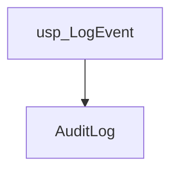
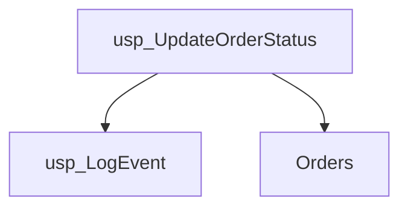
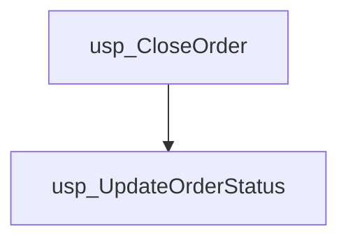
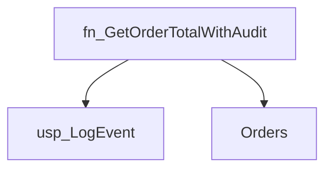
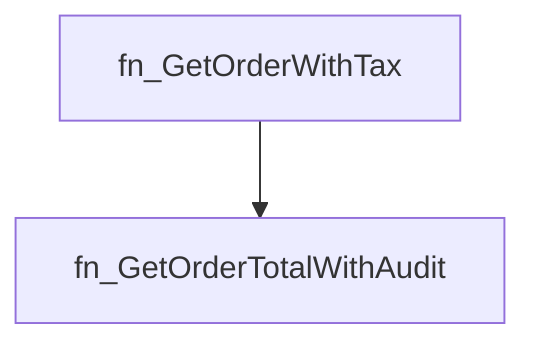
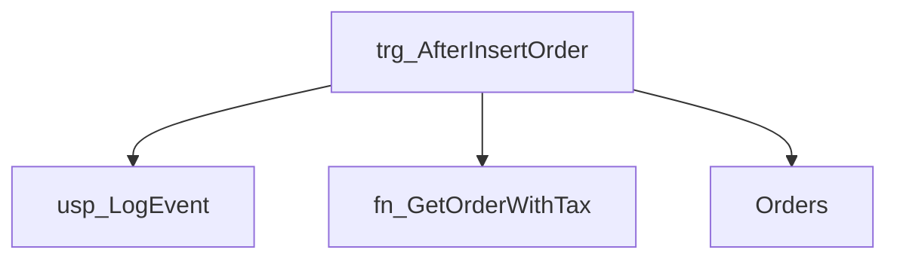

# Summary

- **Total Procedures**: 3
- **Total Functions**: 2
- **Total Triggers**: 1
- **Total Tables**: 2
- **Most Called Object**: `usp_LogEvent`

---

# Table of Contents

- Procedure: [usp_LogEvent](#usp_logevent)
- Procedure: [usp_UpdateOrderStatus](#usp_updateorderstatus)
- Procedure: [usp_CloseOrder](#usp_closeorder)
- Function: [fn_GetOrderTotalWithAudit](#fn_getordertotalwithaudit)
- Function: [fn_GetOrderWithTax](#fn_getorderwithtax)
- Trigger: [trg_AfterInsertOrder](#trg_afterinsertorder)

---

## Procedure: usp_LogEvent

---

### Parameters

| Name | Type |
|------|------|
| @eventType | VARCHAR(50) |
| @message | VARCHAR(200) |

---

### Tables

- AuditLog

---

### Calls

---

### Call Graph

---

### Business Logic

1. Overall Purpose:

The primary business goal of the stored procedure `usp_LogEvent` is to record important events that occur within the system.  This helps maintain an audit trail for tracking system activity, troubleshooting issues, and ensuring accountability.

2. Process Breakdown:

This procedure automates the logging of system events.  It takes two pieces of information as input: the type of event and a description of the event.  It then inserts this information into a table called `AuditLog`.  This table permanently stores a record of every event logged, providing a historical record of system activity.  There are no calculations or conditional logic within the procedure; it simply inserts the provided data into the log.

3. Key Business Rules:

The primary business rule is that all significant events within the system must be logged. This ensures that the system's actions are auditable and allows for investigation of any potential issues or irregularities. There are no other explicit business rules embedded within this procedure's logic; the specific criteria for what constitutes a "significant event" is determined outside of this procedure.

4. Inputs and Outputs:

Inputs:

* `@eventType`: A description of the type of event that occurred (e.g., "User Login", "Order Placed", "Payment Processed").
* `@message`: A more detailed message providing context about the event (e.g., "User John Doe logged in successfully.", "Order #12345 was placed by Jane Doe.", "Payment of $100.00 was received for order #67890").

Outputs:

The procedure doesn't directly produce any output in the sense of a report or result set.  Its output is the addition of a new row to the `AuditLog` table, recording the event details.  This stored log is then available for querying and analysis at a later time.

---

## Procedure: usp_UpdateOrderStatus

---

### Parameters

| Name | Type |
|------|------|
| @orderId | INT |
| @newStatus | VARCHAR(20) |

---

### Tables

- Orders

---

### Calls

- usp_LogEvent

---

### Call Graph

---

### Business Logic

1. Overall Purpose:

The primary business goal of the stored procedure `usp_UpdateOrderStatus` is to efficiently and reliably update the status of an order in the system and record this change in the system's event log.  This ensures accurate order tracking and provides an audit trail of all order status modifications.

2. Process Breakdown:

This procedure automates the process of changing an order's status.  It takes the order ID and the new status as input.  First, it directly updates the 'Status' field in the 'Orders' table for the specified order ID with the provided new status. Then, it calls another stored procedure, `usp_LogEvent`, to record details of this status change in an event log. This logging is crucial for tracking order history, auditing changes, and troubleshooting issues.

3. Key Business Rules:

*   There is an implicit business rule that assumes the provided `@orderId` exists in the 'Orders' table. While not explicitly checked in this procedure, a valid order ID is expected to be passed.  Error handling for non-existent order IDs would likely be implemented elsewhere.
*   The procedure assumes the `@newStatus` value is valid within the system's predefined set of order statuses. No validation is performed within this procedure itself.  Data validation is likely handled in the application layer calling this procedure.
*   The procedure guarantees that any update to an order's status will also be logged for auditing purposes.  This is a crucial business rule for accountability and traceability.

4. Inputs and Outputs:

Inputs:

*   `@orderId`: The unique identifier of the order to be updated. This is an integer.
*   `@newStatus`: The new status for the order (e.g., "Shipped", "Cancelled", "Delivered"). This is a text string.

Outputs:

*   The procedure itself does not directly return any values. However, its side effects are:
    *   The 'Orders' table is updated with the new order status.
    *   An event log entry is created detailing the order ID and the status change.  This is recorded via the call to `usp_LogEvent`.

---

## Procedure: usp_CloseOrder

---

### Parameters

| Name | Type |
|------|------|
| @orderId | INT |

---

### Tables

---

### Calls

- usp_UpdateOrderStatus

---

### Call Graph

---

### Business Logic

1. Overall Purpose:

The primary business goal of the stored procedure `usp_CloseOrder` is to formally close an order in the system.  This signifies the completion of all order-related activities, such as fulfillment, delivery, and payment.

2. Process Breakdown:

This procedure automates the final step in the order lifecycle: changing the order's status to "CLOSED".  It achieves this by calling another stored procedure, `usp_UpdateOrderStatus`. This called procedure is responsible for updating the order's status in the database.  The `@orderId` parameter uniquely identifies the order to be closed.  The procedure doesn't perform any complex calculations or conditional logic; its sole function is to trigger the status update.

3. Key Business Rules:

The only implicit business rule is that an order can only be marked as "CLOSED" once the order process is considered complete. The procedure itself doesn't enforce this rule; it assumes that the calling process has already validated that the order is ready to be closed.  This validation likely occurs before the `usp_CloseOrder` procedure is called.

4. Inputs and Outputs:

* Inputs: The procedure takes one input:  `@orderId`, an integer representing the unique identifier of the order to be closed.
* Outputs: The procedure doesn't directly produce any output values. Its effect is the modification of the order's status within the database, changing it to "CLOSED".  The success or failure of the underlying `usp_UpdateOrderStatus` procedure would determine if the order closure was successful.

---

## Function: fn_GetOrderTotalWithAudit

---

### Parameters

| Name | Type |
|------|------|
| @orderId | INT |

---

### Tables

- Orders

---

### Calls

- usp_LogEvent

---

### Call Graph

---

### Business Logic

1. Overall Purpose:

The primary business goal of the function fn_GetOrderTotalWithAudit is to retrieve the total amount for a specific order and record this retrieval in an audit log. This ensures transparency and traceability of order data access.

2. Process Breakdown:

The function takes an order ID as input.  It then looks up the order in the 'Orders' table to find the corresponding order total.  This total amount is stored in a temporary variable.  Crucially, after retrieving the order total, the function calls another stored procedure, usp_LogEvent, to record an entry in an audit log. This log entry indicates that the function was called and specifies the order ID for which the total was retrieved. Finally, the function returns the retrieved order total.

3. Key Business Rules:

*   All order totals are stored in the 'Orders' table.
*   Access to order totals must be audited for tracking and security purposes.  This is enforced by the call to the usp_LogEvent procedure.
*   The order total is assumed to be directly available in the 'Orders' table and no calculations are performed on the retrieved value.

4. Inputs and Outputs:

*   Input: The function takes a single input, which is the 'OrderID' (an integer) identifying the order whose total is requested.
*   Output: The function returns a decimal value representing the total amount of the specified order.  Additionally, it produces a side effect of writing an audit log entry.

---

## Function: fn_GetOrderWithTax

---

### Parameters

| Name | Type |
|------|------|
| @orderId | INT |

---

### Tables

---

### Calls

- fn_GetOrderTotalWithAudit

---

### Call Graph

---

### Business Logic

1. Overall Purpose:

The primary business goal of the stored procedure `fn_GetOrderWithTax` is to calculate the final price of an order, including a 10% tax, for a given order ID.  This is crucial for generating accurate invoices and managing financial reporting.

2. Process Breakdown:

The procedure takes an order ID as input. It first retrieves the base order amount (excluding tax) using another function, `dbo.fn_GetOrderTotalWithAudit`.  This likely involves summing up the cost of individual items in the order and potentially applying any discounts.  Then, it calculates the total amount including tax by applying a flat 10% tax rate to the base amount.  Finally, it returns the calculated final price (base amount plus tax).

3. Key Business Rules:

- A 10% tax is applied to all orders.  This reflects a specific tax regulation or policy applicable to the business.  The tax calculation is hardcoded; adjustments require modifying the stored procedure.

4. Inputs and Outputs:

- Input:  The procedure requires an order ID (an integer) to identify the specific order for which to calculate the final price.
- Output: The procedure returns a decimal value representing the final order total including the 10% tax.  This value is ready for use in invoice generation, reporting, or other downstream financial processes.

---

## Trigger: trg_AfterInsertOrder

---

### Tables

- Orders

---

### Calls

- usp_LogEvent
- fn_GetOrderWithTax

---

### Call Graph

---

### Business Logic

1. Overall Purpose:

The primary business goal of the `trg_AfterInsertOrder` trigger is to automatically record and log key information whenever a new order is added to the Orders table. This ensures a complete audit trail of all order creation events and provides valuable data for monitoring and analysis.  It also calculates and logs the total amount including tax for each new order.

2. Process Breakdown:

This trigger automatically activates every time a new order is inserted into the Orders table.  It works as follows:

a. It first retrieves the newly inserted order's ID (@orderId) and its total amount (@amount).  This information is readily available because the trigger fires *after* the insertion.

b. It then calls a stored procedure, `usp_LogEvent`, to record a log entry indicating that a new order has been created, including the order ID and the initial amount. This ensures that all order insertions are tracked.

c. Next, it calls a function, `dbo.fn_GetOrderWithTax`, to calculate the total order amount including taxes.  This function likely incorporates business rules about tax rates and calculations.

d. Finally, it calls `usp_LogEvent` again to record the calculated total amount including tax for the newly inserted order. This second log entry provides a complete picture of the order's final cost.

3. Key Business Rules:

The trigger itself doesn't explicitly contain business rules, but it relies on the rules embedded within the `dbo.fn_GetOrderWithTax` function.  These rules likely determine how taxes are calculated, potentially based on factors like the order's value, location, or the goods being ordered.  It's crucial for business analysis to understand the rules within the `fn_GetOrderWithTax` function.

4. Inputs and Outputs:

Inputs: The trigger's input is implicit.  It automatically receives the data from the `INSERTED` table which contains information about the newly inserted row in the Orders table. This includes, at least, the OrderID and Amount fields.

Outputs: The trigger doesn't directly produce any output in the traditional sense (like returning values).  Its primary output is the creation of two log entries within the system's logging mechanism (via `usp_LogEvent`). These log entries provide an audit trail tracking new order creation and including the calculated total amount with tax for each order.

---

